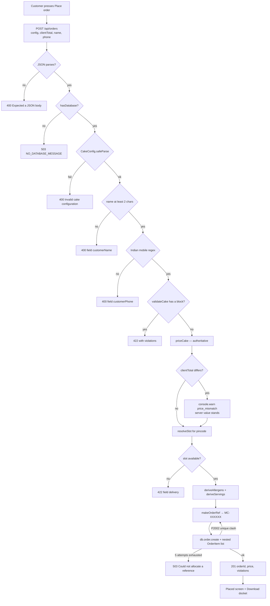
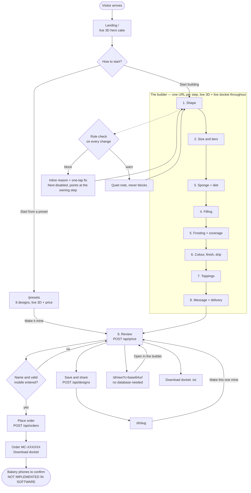
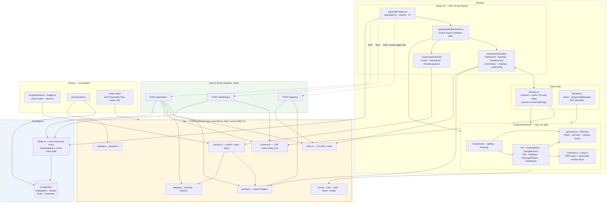
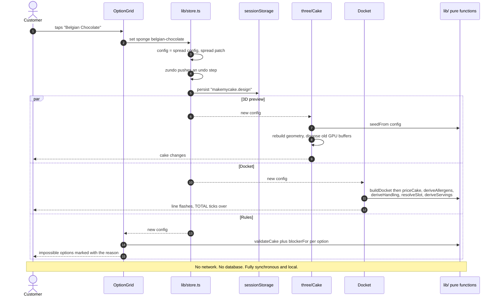
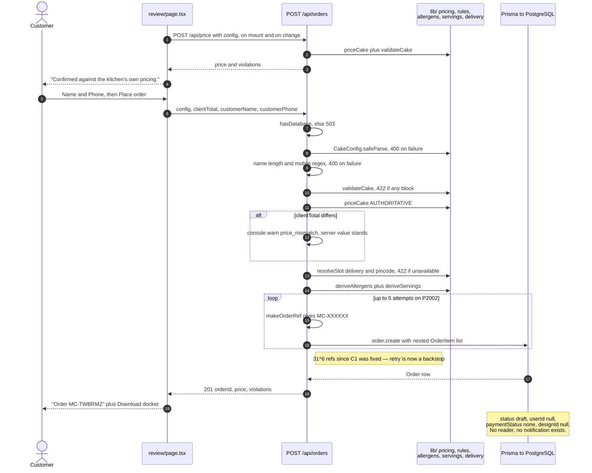

# Makemycake — Reverse-Engineered Project Documentation

> **Status of this document.** Produced by reading the source code, not the README.
> Every claim below is traceable to a file path. Where the code does not settle a
> question, the entry is marked **Unknown / Needs Confirmation** rather than guessed.
>
> **Repository directory:** `/Users/tathagatharsh/Desktop/Tripee`
> **Actual project name:** `makemycake` (`package.json:2`) — the containing folder name
> `Tripee` is unrelated to the product and appears nowhere in the code.
> **Analysed at commit:** `8fdf8db` — "Initial commit: MakeMyCake Next.js application"
> (single commit; the whole product landed at once, so git history yields no
> evolution signal).
> **Working tree at first analysis:** clean except `package-lock.json`.
>
> ---
>
> ### Revision — after the Supabase connection and the first round of fixes
>
> The app now runs against a live PostgreSQL database (Supabase), and eight
> findings this document originally reported — **C1**, **H1**, **H4**, **H5**,
> **H6**, **H7**, **M1/M2** and **M13** — have been fixed and verified end to end. H6 was the largest: orders are now
> readable and advanceable through a gated staff board at `/kitchen`, so the
> product can finally fulfil what it takes.
> Fixed items are marked **✅ FIXED** inline and
> the original finding is left in place rather than deleted: the finding is *why*
> the code looks the way it does, and a reader arriving at the diff needs both
> halves.
>
> Two findings were added that could not exist before a database was attached:
> **S1** (RLS, now fixed) and **S2** (SSL enforcement, open).
>
> **Uncommitted at time of revision:** `lib/share.ts`,
> `app/build/review/page.tsx`, `tests/derived.test.ts`, `e2e/happy-path.spec.ts`,
> plus an untracked `.env` (gitignored). `package-lock.json` was already modified
> before any of this work began.
>
> **Full suite status at revision:** `tsc --noEmit` clean · `eslint` clean ·
> `npm test` 69 passed · `npm run e2e` 6 passed · `npm run a11y` 11 passed ·
> `npm run visual` 6 passed · `next build` succeeds.

**Legend used throughout**

| Marker | Meaning |
|---|---|
| ✅ **Implemented** | Code exists, is reachable from the UI or an API, and does the thing |
| 🟨 **Partial** | Some of the machinery exists; the workflow does not complete |
| 🟥 **Broken / Unreachable** | Code exists but no caller reaches it, or the flow fails |
| 📋 **Planned / Referenced** | Named in schema, comments, or docs; no implementation |
| ❓ **Unknown** | Cannot be determined from the code alone |

---

## Table of Contents

1. [Product Understanding](#1-product-understanding)
2. [Users & Roles](#2-users--roles)
3. [Core User Journey](#3-core-user-journey)
4. [Feature Inventory](#4-feature-inventory)
5. [Application Architecture](#5-application-architecture)
6. [Database & Data Flow](#6-database--data-flow)
7. [Routes & Pages](#7-routes--pages)
8. [API Inventory](#8-api-inventory)
9. [Authentication & Permissions](#9-authentication--permissions)
10. [Environment & Deployment](#10-environment--deployment)
11. [Codebase Structure](#11-codebase-structure)
12. [Technical Debt & Risks](#12-technical-debt--risks)
13. [Current Product State](#13-current-product-state)
14. [Reverse-Engineered PRD](#14-reverse-engineered-prd)
15. [Diagrams](#15-diagrams)
16. [Important Files](#16-important-files)
17. [How To Continue Development](#17-how-to-continue-development)
18. [Project Master Summary](#18-project-master-summary)

---

## 1. Product Understanding

### What this product is

**Makemycake is a 3D cake configurator for a single bakery in Jubilee Hills, Hyderabad.**

A customer walks through nine steps — shape, size, sponge, filling, frosting, colour
and finish, toppings, message, review — and a photorealistic 3D cake updates in the
browser at every tap. The price is recalculated and shown itemised the whole time.
At the end the customer gets an **order docket**: a monospace spec sheet with the
build, the itemised price, derived allergens, serving count, storage instructions
and delivery lead time — the artifact a real kitchen would work from.

### What problem it solves

Three problems, all visible in the code as first-class concerns:

1. **You cannot see what you are ordering.** Most cake-ordering sites show a stock
   photo of a cake that is not the one you will get. Here the render is built from
   the same config object the kitchen docket is built from
   (`lib/schema.ts` → `components/three/Cake.tsx` and `lib/docket.ts`).
2. **The price appears at checkout.** Here it is on screen from the first step,
   itemised by line, with each option carrying its own `+₹200` delta
   (`components/builder/OptionGrid.tsx:74-76`, `lib/pricing.ts:209-214`).
3. **You can order a cake that cannot be baked.** Whipped cream does not hold a
   second tier; fondant does not come rustic. Twelve rules block or warn *at the
   moment of choosing*, in plain language, with a one-tap fix
   (`lib/rules.ts`, `components/builder/ViolationCard.tsx`).

### Who uses it

- **The cake buyer** (public, anonymous). The only role the software actually knows about.
- **The kitchen** — implied, not implemented. They are the audience for the docket
  (`lib/docket.ts:209` `renderSpecSheet`), but there is no kitchen-facing screen,
  login, or notification anywhere in the codebase.
- **The developer** — `/lab` and `/lab/[index]` are internal render-tuning tools,
  `noindex`'d but publicly reachable (`app/lab/page.tsx:6`).

### Primary value proposition

*Design it, see it, know exactly what it costs and exactly what is in it — before
anyone takes your money.* The product deliberately takes no money at all:
`app/build/review/page.tsx:226-229` says "No payment now. We call to confirm."

### Non-goals, stated in the code

`prisma/schema.prisma:93-96` and `lib/pricing.ts:15` leave explicit hooks for auth
and payments and explain that v1 has neither. This is a deliberate scope boundary,
not an oversight.

---

## 2. Users & Roles

**There is exactly one role in the software: anonymous public visitor.** There is no
authentication layer, no session, no role check, and no authorization anywhere in the
repository (see §9).

| Role | Can see | Can do | Cannot do | Enforced by |
|---|---|---|---|---|
| **Anonymous visitor** (the only implemented role) | Landing, presets, all 9 builder steps, live 3D, live itemised price, docket, shared designs | Build a cake, undo/redo, cut a slice, save a design to a short URL, download the docket as `.txt`, place an order (name + phone) | Nothing is restricted — every route and every API is open | No code. Absence of any auth check |
| **Kitchen / staff** 📋 | — | — | — | Not implemented. No admin route, no order-listing endpoint, no login |
| **Registered user** 📋 | — | — | — | Not implemented. `Order.userId` exists and is always written as `null` (`app/api/orders/route.ts:107`) |
| **Developer** (informal) | `/lab`, `/lab/[index]` | Compare 12 extreme cakes, toggle cut/auto-rotate | — | Nothing. `robots: noindex` only (`app/lab/page.tsx:6`) — this is *not* access control |

**Permission model, stated plainly:** every visitor has every permission the product
offers. The three API routes accept any request from anyone.

---

## 3. Core User Journey

Traced from the actual code, not from the README.

```
Landing (/)                                   app/page.tsx
  hero shows a live 3D two-tier preset cake     app/page.tsx:9,65
  → "Start building"                            app/page.tsx:44-49
       or → "Start from a preset" (/presets)    app/presets/page.tsx

/build → redirect → /build/shape              app/build/page.tsx:4

BuilderShell mounts                           app/build/BuilderShell.tsx
  useHydrated() reads sessionStorage            lib/store.ts:79-97
  until hydrated: skeletons, no cake            BuilderShell.tsx:104-108,135
  once hydrated: 3-pane layout
      left  = LazyCakeScene (dynamic, ssr:false)
      centre= the step's controls
      right = live Docket (desktop) / total bar (mobile)

Step 1 shape    → OptionGrid patches {shape}    app/build/shape/page.tsx
Step 2 size     → size, tiers, layers           app/build/size/page.tsx
Step 3 sponge   → sponge, eggless, sugarFree    app/build/sponge/page.tsx
Step 4 filling  → filling                       app/build/filling/page.tsx
Step 5 frosting → frosting, coverage            app/build/frosting/page.tsx
Step 6 finish   → frostingColor, finish, drip   app/build/finish/page.tsx
Step 7 toppings → up to 4 × {kind,placement,density}  app/build/toppings/page.tsx
Step 8 message  → message, messageColor, delivery, pincode  app/build/message/page.tsx

  EVERY tap: useSetConfig() → Zustand store     lib/store.ts:21,100
    → zundo records an undo step                lib/store.ts:18,25-29
    → persist writes sessionStorage             lib/store.ts:32-35
    → 3D re-renders from the same config        components/three/Cake.tsx:28
    → priceCake() recomputes for the docket     lib/pricing.ts:110
    → validateCake() re-runs 12 rules           lib/rules.ts:114
    → blockerFor() marks impossible options     lib/rules.ts:130

Step 9 review   → /build/review                 app/build/review/page.tsx
  on mount: POST /api/price to confirm          review/page.tsx:52
    server total == client total → "Confirmed"  review/page.tsx:178
    mismatch → "Kitchen says ₹X — that stands"  review/page.tsx:177
  customer types Name + Phone                   review/page.tsx:206-224
  button enables only when contact is valid     review/page.tsx:43-46

  → "Place order"  POST /api/orders             review/page.tsx:81
       server re-validates config, name, phone,
       block-rules, delivery availability       app/api/orders/route.ts:30-91
       server reprices authoritatively          orders/route.ts:68
       creates Order + OrderItem[]              orders/route.ts:99-127
       returns { orderId: "MC-XXXXXX" }         orders/route.ts:129
  → "Order MC-TWBRMZ" confirmation screen       review/page.tsx:301-332
       + Download docket (.txt)                 review/page.tsx:112-121

Side exits available at review:
  "Save & share"  POST /api/designs → /d/<slug>  review/page.tsx:102
  "carry in URL"  → /d/new?c=<base64url>         review/page.tsx:293

Returning later:
  same tab, refresh → sessionStorage restores    lib/store.ts:32-55
  new tab / new day → work is GONE (see §12)
  a shared link      → /d/[slug] or /d/new
       → "Make this one mine" loads it into the
         store and lands on /build/review        components/builder/LoadConfig.tsx
```

**What the journey does *not* include:** signup, login, payment, order tracking,
email/SMS confirmation, or any way to see the order again after leaving the page.
The order reference on screen is the only artifact the customer keeps.

---

## 4. Feature Inventory

### 4.1 Core functionality

| Feature | Description | Role | Implemented? | Relevant files | Notes |
|---|---|---|---|---|---|
| Single-object cake config | One Zod-validated JSON object is the sole source of truth; UI edits it, renderer reads it, server prices it | Visitor | ✅ | `lib/schema.ts` | 20 fields, `version: 1` literal. Architectural keystone |
| Nine-step builder | Each step is its own URL; back/forward/refresh all behave | Visitor | ✅ | `app/build/*/page.tsx`, `lib/catalog.ts:180-190` | `STEPS` array drives nav and progress |
| Live 3D preview | Procedural cake rebuilt on every config change | Visitor | ✅ | `components/three/` (16 files) | No models, no textures fetched |
| Cutaway "cut a slice" | Removes a wedge so sponge layers + filling read as a cross-section | Visitor | ✅ | `lib/view.ts`, `geometry.ts:275-527` | Deliberately *not* a config field |
| Undo / redo | ⌘Z / Ctrl+Z anywhere, plus visible buttons; 50-step history | Visitor | ✅ | `lib/store.ts:18-29`, `components/builder/UndoBar.tsx` | zundo `temporal` |
| Session persistence | Refresh does not lose the design | Visitor | ✅ | `lib/store.ts:31-56` | `sessionStorage`, not `localStorage` — see §12 |
| Partial-config salvage | A half-typed pincode no longer discards the whole saved cake | Visitor | ✅ | `lib/store.ts:38-55` | Drops only the failing fields, re-parses |
| Preset gallery | 8 finished cakes, "Make it mine" lands on Review | Visitor | ✅ | `lib/presets.ts`, `app/presets/page.tsx` | Tested for validity (`tests/derived.test.ts:176`) |
| Render lab | 12 deliberately extreme cakes side by side | Developer | ✅ | `app/lab/`, `app/lab/configs.ts` | Internal tool, `noindex`, publicly reachable |

### 4.2 Pricing

| Feature | Description | Role | Implemented? | Relevant files | Notes |
|---|---|---|---|---|---|
| Pure pricing engine | Paise as integers; no DB, no React, no I/O | — | ✅ | `lib/pricing.ts:110-206` | 14 unit tests |
| Itemised breakdown | Every line names a real thing; never collapsed | Visitor | ✅ | `components/docket/PriceBreakdown.tsx` | Deliberate anti-"mystery total" |
| Per-option price deltas | Each swatch shows what choosing it would cost | Visitor | ✅ | `lib/pricing.ts:209-214`, `OptionGrid.tsx:74` | Free options print nothing |
| Size multiplier | Modifiers scale 0.7×–3× by size band; base does not double-scale | — | ✅ | `pricing.ts:105-108` | Explicitly tested |
| 18% GST | Applied to subtotal | — | ✅ | `pricing.ts:201-203` | Hardcoded rate |
| Server-verified price | Client number advisory; server recomputes with the *same* function | Visitor | ✅ | `app/api/price/route.ts`, `orders/route.ts:68-73` | Mismatch is logged, server wins |
| `payable` split from `total` | Pre-carved seam for a future gateway | — | ✅ (as a hook) | `pricing.ts:15-17,205` | Currently always `payable === total` |

### 4.3 Rules & validation

| Feature | Description | Role | Implemented? | Relevant files | Notes |
|---|---|---|---|---|---|
| 12 compatibility rules | 8 blocking, 4 warning | Visitor | ✅ | `lib/rules.ts:15-112` | Structural, finish, climate, aesthetic, dietary |
| One-tap fixes | Every blocking rule carries a patch that clears it | Visitor | ✅ | `rules.ts:22,30,38,47,55,63,71,110` | `tests/rules.test.ts:121` asserts every fix works |
| Pre-emptive option marking | An option shows *the violation it would introduce*, not one you already have | Visitor | ✅ | `rules.ts:130-146` | Subtle and correct; well-tested |
| Blocked "Next" with wayfinding | Next disables and links to the step that owns the blocker | Visitor | ✅ | `components/builder/StepNav.tsx:113-177` | `FIELD_STEP` map at `StepNav.tsx:11-20` |
| Server-side re-validation | 422 if a blocked config is submitted | — | ✅ | `orders/route.ts:59-65` | Server does not trust the client |
| Zod schema validation | Every API boundary parses with `CakeConfig.safeParse` | — | ✅ | all three routes | Strong trust boundary |
| Contact validation | Name ≥ 2 chars, Indian mobile regex, enforced on *both* sides | Visitor | ✅ | `orders/route.ts:42-57`, `review/page.tsx:43-45` | Server insists because the form is not the only caller |
| Delivery-availability enforcement | Order refused if the slot is not offered for that pincode | Visitor | ✅ | `orders/route.ts:83-91` | Closes a real gap between screen and API |

### 4.4 Derived data (the docket)

| Feature | Description | Role | Implemented? | Relevant files | Notes |
|---|---|---|---|---|---|
| Allergen derivation | Computed from sponge + filling + frosting + toppings + drip; never hand-typed | Visitor | ✅ | `lib/allergens.ts` | Includes an eggless-but-meringue caveat |
| Serving count | 100 g portions, assumption stated on screen | Visitor | ✅ | `lib/servings.ts:30-44` | |
| Handling / shelf life | 24 h for perishable builds, else 48 h | Visitor | ✅ | `servings.ts:53-76` | |
| Delivery zones & lead times | 3 Hyderabad pincode zones, per-slot availability, rider surcharge | Visitor | ✅ | `lib/delivery.ts` | Hardcoded pincode ranges |
| Live docket panel | Monospace kitchen ticket, pinned; changed line flashes | Visitor | ✅ | `components/docket/Docket.tsx`, `DocketLine.tsx` | |
| Plain-text spec sheet | Downloadable `.txt`, identical in browser and terminal | Visitor | ✅ | `lib/docket.ts:209-287` | |
| Docket CLI | `npm run docket -- --preset <slug>` prints the sheet | Developer | ✅ | `scripts/docket.ts` | Exercises pricing + rules headlessly |
| FSSAI licence line | Renders only if the real number is configured | Visitor | ✅ (opt-in) | `lib/docket.ts:15,281-284` | Deliberately blank — no invented registration |
| "Cakes we've delivered" | Photo strip on the review page | Visitor | 🟨 | `lib/photos.ts:18`, `review/page.tsx:182-196` | Wiring complete; `DELIVERED_PHOTOS` is `[]`, so the section never renders. Deliberate |
| Docket "stamped" overlay | A rotated CONFIRMED-style stamp over the ticket | Visitor | 🟥 | `Docket.tsx:14-15,87-93`, `globals.css:119` | **No caller ever passes `stamped` or `reference`.** Dead UI |

### 4.5 Sharing

| Feature | Description | Role | Implemented? | Relevant files | Notes |
|---|---|---|---|---|---|
| Save design → short URL | 7-char unambiguous slug, DB-backed | Visitor | ✅ (needs DB) | `app/api/designs/route.ts`, `lib/share.ts:24-31` | 31⁷ space, collision-checked. Failure is now reported to the customer — see H1 ✅ FIXED |
| Shared design page | 3D preview, price breakdown, allergens, "Make this one mine" | Visitor | ✅ (needs DB) | `app/d/[slug]/page.tsx` | Generates OG metadata |
| URL-carried design | Whole config base64url-encoded in the query string; no DB row | Visitor | ✅ | `app/d/new/page.tsx`, `lib/share.ts:4-22` | Survives a WhatsApp forward |
| View counter | `Design.views` incremented per visit | — | 🟨 | `app/d/[slug]/page.tsx:52` | Written, **never read or displayed** anywhere |
| Schema migration hook | `migrateConfig` for future v2 configs | — | 📋 | `lib/schema.ts:124-131` | Hook exists; only v1 exists, so it is currently a passthrough parse |

### 4.6 Orders

| Feature | Description | Role | Implemented? | Relevant files | Notes |
|---|---|---|---|---|---|
| Place order | Creates `Order` + `OrderItem[]`, mints an `MC-XXXXXX` reference | Visitor | 🟨 | `app/api/orders/route.ts` | Reference exhaustion fixed (C1 ✅). Still partial only because **nothing can read an order back** — see H6 |
| Frozen line items | Price lines copied onto the order so catalogue edits cannot rewrite history | — | ✅ | `orders/route.ts:118-125` | |
| Link order → saved design | `designSlug` sent by the client, resolved to `designId` | — | ✅ | `orders/route.ts:93-95,117`, `review/page.tsx` `place()` | **H4 ✅ FIXED.** The server always supported this; the client never sent it, so every `Order.designId` was `null`. The slug is now stored alongside the config it was saved from and only sent while that config is still current |
| `OrderItem.catalogItemId` | FK from a docket line to the catalogue row | — | 🟥 | `schema.prisma:129-131` | Never populated. Always `null`, contradicting the schema's own comment |
| Order status lifecycle | `draft → confirmed → in_kitchen → out_for_delivery → delivered`, plus `cancelled` from any open state | Staff | ✅ | `lib/orders.ts`, `app/kitchen/actions.ts` | **H6 ✅.** Forward-only; re-checked server-side, so a stale page cannot skip steps |
| Staff order board | Every docket newest-first, filterable, with the spec sheet and advance buttons | Staff | ✅ | `app/kitchen/page.tsx`, `proxy.ts` | **H6 ✅.** HTTP Basic, fails closed when unconfigured |
| Order notification | Tell the kitchen an order arrived | Staff | 📋 | — | Not started. Needs an email/SMS provider; staff must watch the board |
| Customer order lookup | Look up your own order by reference | Visitor | 📋 | — | No customer-facing GET. Once the tab closes, the customer has only the reference |
| Graceful no-DB mode | Honest 503 with a human message instead of a stack trace | Visitor | ✅ | `lib/db.ts:15-17,41-43` | Designing/pricing still works with no database |

### 4.7 3D rendering

| Feature | Description | Implemented? | Relevant files |
|---|---|---|---|
| Procedural geometry for 6 shapes | round + bundt as UV-corrected lathes; square/rectangle/hexagon/heart as bevelled extrudes | ✅ | `geometry.ts:315-527` |
| Frosting shell | Tier profile grown by thickness, displaced by seeded fbm noise per finish | ✅ | `geometry.ts:558-614` |
| 6 finishes | smooth, rustic, ruffle, rosette, combed, ombré | ✅ | `geometry.ts:533-551`, `FrostingShell.tsx` |
| Instanced ruffles & rosettes | Laid out on the shell's *measured* outline, not a circle | ✅ | `FrostingShell.tsx:79-240`, `geometry.ts:951-975` |
| Drips | Seeded angles, tapered lathe, pooled rim ring following the real silhouette | ✅ | `Drip.tsx`, `geometry.ts:689-766` |
| 12 topping geometries | All built from primitives, instanced, 5 placements × density 1–5 | ✅ | `toppingGeometry.ts`, `Toppings.tsx` |
| Message plaque | Canvas-drawn lettering used as both colour and bump map | ✅ | `MessagePlaque.tsx` |
| Plaque lift-while-typing | Hovers clear while composing, settles on Done/Enter | ✅ | `MessagePlaque.tsx:195-215`, `lib/view.ts:22-23` |
| Toppings keep off the plaque | Footprint computed once and passed down | ✅ | `MessagePlaque.tsx:42-56`, `Toppings.tsx:44-61` |
| Ombré vertex gradient | Baked into a colour attribute | ✅ | `useDisposable.ts:34-60` |
| Procedural normal maps | 6 maps generated from value noise, cached, no network | ✅ | `noise.ts` |
| Lightformer environment | No HDR download; art-directed studio rig | ✅ | `Lighting.tsx` |
| Deterministic seeding | Everything random hashes from the *render-relevant* config fields only | ✅ | `lib/seed.ts:17-31` |
| Adaptive quality | Heuristic guess then a real 1.2 s frame-rate measurement → HIGH/LOW | ✅ | `lib/quality.ts` |
| Camera auto-framing | Fits vertically *and* horizontally; accounts for crown toppings | ✅ | `CakeScene.tsx:121-190` |
| GPU disposal | Geometries/textures released on replace and unmount | ✅ | `useDisposable.ts:20-31` |
| Colour clamping | Saturation/lightness pulled to what a kitchen can mix, and it says so | ✅ | `lib/color.ts:44-72`, `ColorPicker.tsx:63-72` |
| Lazy 3D bundle | `next/dynamic`, `ssr:false`, skeleton fallback | ✅ | `LazyCakeScene.tsx` |
| On-demand frameloop | Static previews render on demand, not at 60 fps | ✅ | `CakeScene.tsx:61` |

### 4.8 Accessibility & motion

| Feature | Implemented? | Relevant files |
|---|---|---|
| `radiogroup` semantics + roving tabindex + arrow keys | ✅ | `OptionGrid.tsx:56-86` |
| 3D pane labelled as a figure with a prose caption of the cake | ✅ | `BuilderShell.tsx:95-103,168-184` |
| Polite live region announcing the running total | ✅ | `BuilderShell.tsx:138-140` |
| Focus + scroll reset on step change | ✅ | `BuilderShell.tsx:42-48` |
| `prefers-reduced-motion` respected in DOM *and* in 3D | ✅ | `lib/useReducedMotion.ts`, `globals.css:160-169`, `CakeScene.tsx:108`, `MessagePlaque.tsx:205` |
| Keyboard-reachable scrollable docket region | ✅ | `Docket.tsx:44-49` |
| Disabled primary button keeps contrast (colour change, not alpha) | ✅ | `review/page.tsx:250-263` |
| axe-core WCAG 2.1 A/AA sweep over 9 routes | ✅ | `e2e/a11y.spec.ts` |

### 4.9 Testing & tooling

| Feature | Command | Count | Files |
|---|---|---|---|
| Unit tests (pricing, rules, derived) | `npm test` | 69 tests across 4 files (15 + 17 + 31 + 6) | `tests/*.test.ts` |
| End-to-end happy path | `npm run e2e` | 6 tests | `e2e/happy-path.spec.ts` |
| Visual regression baselines | `npm run visual` | 6 screenshots | `e2e/visual.spec.ts`, `e2e/snapshots/` |
| Accessibility sweep | `npm run a11y` | 11 tests | `e2e/a11y.spec.ts` |
| Bundle budget measurement | `npm run budget` | — | `scripts/budget.ts` |
| Screenshot / demo capture | `npm run shot`, `shoot`, `demo` | — | `scripts/shoot*.ts`, `scripts/demo.ts` |
| Type check / lint | `npm run typecheck`, `npm run lint` | — | `tsconfig.json`, `eslint.config.mjs` |

### 4.10 Categories with **nothing** implemented

| Category | State | Evidence |
|---|---|---|
| **Authentication** | 📋 Not started | No auth library, no session, no middleware, no login route. `Order.userId` hardcoded `null` (`orders/route.ts:107`) |
| **User management** | 📋 Not started | No `User` model in `prisma/schema.prisma` |
| **Dashboard** | 📋 Not started | No route renders a list of anything a user owns |
| **Admin functionality** | 🟨 Partial | `/kitchen` lists and advances orders (H6 ✅). Still no catalogue editor, no per-person staff identity, no audit trail |
| **Notifications** | 📋 Not started | No email, SMS, or webhook code. `pg` is the only outbound integration |
| **Payments** | 📋 Not started | `PaymentStatus` enum + `payablePaise` exist as hooks; Razorpay named only in a comment (`schema.prisma:95`). No SDK in `package.json` |
| **Analytics** | 📋 Not started | No analytics SDK. `Design.views` is incremented but never read |
| **Settings** | 📋 Not started | No settings surface of any kind |
| **Inventory / delivery tracking / reviews** | 📋 Not started | Named as out-of-scope in `README.md:160-161` |

---

## 5. Application Architecture

### 5.1 Frontend

| Concern | Choice | Where |
|---|---|---|
| Framework | **Next.js 16.2.12, App Router**, React 19.2.4, TypeScript `strict` | `package.json`, `tsconfig.json:7` |
| Rendering strategy | Server Components by default; builder steps are `"use client"`. 3D is client-only via `next/dynamic` with `ssr:false` | `LazyCakeScene.tsx:11-14` |
| Routing | File-system App Router. One URL per builder step | `app/build/<slug>/page.tsx` |
| Layout | Root layout loads 3 Google fonts as CSS variables; `/build` has a nested layout wrapping everything in `BuilderShell` | `app/layout.tsx`, `app/build/layout.tsx` |
| Client state | **Zustand 5** + **zundo 2** (`temporal`, limit 50) + `persist` to `sessionStorage`, `skipHydration: true` with manual rehydrate | `lib/store.ts` |
| Second store | `useView` — ephemeral view state (`sliced`, `composingMessage`), deliberately *not* persisted and *not* part of the config | `lib/view.ts` |
| Data fetching | Server Components query Prisma directly. Client uses three plain `fetch` calls, all from the review page. **No React Query / SWR / server actions** | `review/page.tsx:52,81,103` |
| Forms | Uncontrolled-ish React `useState`; **no form library**, no `<form onSubmit>` — buttons call handlers directly | `review/page.tsx:206-224` |
| UI library | **None.** Every component is hand-written | `components/` |
| Styling | **Tailwind CSS v4** via `@tailwindcss/postcss`, configured entirely in CSS with `@theme` — no `tailwind.config.js` | `app/globals.css:13-58`, `postcss.config.mjs` |
| Design tokens | 6 neutrals + 1 accent (`--color-seal`, meaning "blocked" and nothing else), a 5-step type scale, 3 motion durations | `globals.css:13-58` |
| Responsive method | **Container queries** (`@container`) for the controls column, viewport queries for the shell | `BuilderShell.tsx:132`, `OptionGrid.tsx:49-53` |
| 3D | `@react-three/fiber` 9 + `@react-three/drei` 10 + `three` 0.185 | `components/three/` |

**Component structure**

```
components/
├── CakePreview.tsx          read-only 3D wrapper (landing, presets, /d/*)
├── builder/                 the 9-step control surface
│   ├── OptionGrid.tsx       ← the workhorse: radiogroup + delta + blocker
│   ├── StepNav.tsx          StepNav (progress) + StepFooter (prev/next)
│   ├── StepHeader.tsx       title + hint
│   ├── ColorPicker.tsx      palette + native picker + clamp explanation
│   ├── ViolationCard.tsx    inline block/warn card with the one-tap fix
│   ├── UndoBar.tsx          undo / redo / start again + ⌘Z
│   └── LoadConfig.tsx       load a preset or shared design into the store
├── docket/                  the trust surface
│   ├── Docket.tsx           full ticket + DocketTotal (mobile bar)
│   ├── DocketLine.tsx       one row, flashes when its value changes
│   └── PriceBreakdown.tsx   itemised lines → subtotal → GST → TOTAL
└── three/                   the renderer (16 files, ~3,400 lines)
    ├── CakeScene.tsx        Canvas, camera, framing, OrbitControls
    ├── Cake.tsx             composes tiers from the config
    ├── Tier.tsx             decides shell vs. interior vs. top disc
    ├── FrostingShell.tsx    shell mesh + instanced ruffles/rosettes
    ├── SpongeLayers.tsx     sponge + filling slabs
    ├── Drip.tsx / MessagePlaque.tsx / Toppings.tsx / CakeBoard.tsx / Lighting.tsx
    ├── geometry.ts          1,038 lines — all procedural geometry + the cutaway
    ├── materials.ts         PBR specs per frosting/sponge/filling/topping
    ├── toppingGeometry.ts   12 garnish geometries from primitives
    ├── noise.ts             value noise → 6 cached normal maps
    └── useDisposable.ts     GPU lifetime management + ombré gradient
```

### 5.2 Backend

| Concern | Choice | Where |
|---|---|---|
| Runtime | Next.js Route Handlers on Node (Prisma + `pg` require Node, not Edge) | `app/api/*/route.ts` |
| API style | Three `POST`-only JSON endpoints. **No REST resource semantics, no GET, no server actions** | §8 |
| Middleware | `proxy.ts` — HTTP Basic on `/kitchen/:path*` only. (Next 16 deprecates the `middleware.ts` filename in favour of `proxy.ts`; the build warns if you use the old one.) Nothing else is intercepted | `proxy.ts` |
| Authentication | **None** | §9 |
| Authorization | **None** | §9 |
| Validation | Zod `safeParse` at every boundary, plus hand-written name/phone regexes | `orders/route.ts:30-57` |
| Business logic location | **Pure functions in `lib/`**, imported identically by client, server, and CLI. This is the single most important architectural fact in the project | `lib/pricing.ts`, `lib/rules.ts`, `lib/allergens.ts`, `lib/servings.ts`, `lib/delivery.ts`, `lib/docket.ts` |
| ORM | Prisma 7 with the `@prisma/adapter-pg` driver adapter | `lib/db.ts:19-25` |
| Client lifecycle | Lazily constructed, cached on `globalThis`, exposed through a `Proxy` so importing the module never requires a database | `lib/db.ts:27-39` |
| Error handling | Try/catch → typed JSON error bodies with correct status codes (400/422/500/503) | all three routes |

**Why this is a Next app rather than a Vite SPA** — stated in `README.md:84-89` and
proven by `app/api/price/route.ts`: the *same* `priceCake()` function runs on the
client for the live estimate and on the server for the authoritative number.

### 5.3 Database

- **PostgreSQL**, via Prisma 7 (`prisma/schema.prisma:9-11`).
- Schema is applied with `prisma db push` — **there is no `prisma/migrations`
  directory**, even though `prisma.config.ts:17` points at one.
- Seeded by `prisma/seed.ts`, which derives catalogue prices from `lib/pricing.ts`
  so the engine stays the authority on money.

**Models**

| Model | Purpose | Key fields | Read by app code? |
|---|---|---|---|
| `Design` | A saved, shareable cake | `slug` (unique), `config` (Json), `totalPaise`, `views` | ✅ `designs/route.ts`, `d/[slug]/page.tsx`. `views` is written but never read |
| `Order` | A placed order | `ref` (unique), `config`, `priceBreakdown`, `totalPaise`, `payablePaise`, `status`, `userId?`, `paymentStatus`, contact, delivery, `allergens[]`, `servesMin/Max` | ✅ created only. Never read back by anything |
| `OrderItem` | One frozen price line | `label`, `kind`, `amountPaise`, `position`, `catalogItemId?` | ✅ created via nested write. `catalogItemId` always `null` |

**Conceptual relationships (only what the code supports)**

```
Design ──1:N──▶ Order          (populated since H4)
Order  ──1:N──▶ OrderItem      (cascade delete)

User   ──▶ Order               📋 Order.userId is a nullable String with NO User model
```

`CatalogItem` and `OrderItem.catalogItemId` were removed in `2_drop_catalog_item` — see
H2/H3. The database now holds only what cannot be recomputed: saved designs, and orders
with their price lines frozen at the moment they were agreed.

### 5.4 External services

| Service | Used for | Where | Notes |
|---|---|---|---|
| **PostgreSQL** | The only true external dependency | `lib/db.ts` | Optional at runtime; absence is a first-class state |
| **Google Fonts** | Bricolage Grotesque, Inter, Martian Mono | `app/layout.tsx:2-24` | Via `next/font/google` — self-hosted at build time, so no runtime request |
| **Vercel** | Hosting (inferred) | `.vercelignore` | No `vercel.json`; inferred from the ignore file and `docs/SESSION-SUMMARY.md:23` |

**There are no other external services.** No payment gateway, no auth provider, no
email/SMS, no analytics, no error tracking, no CDN assets, no object storage. The 3D
scene makes **zero** network requests at runtime by design (`README.md:93-96`).

---

## 6. Database & Data Flow

### 6.1 Flow A — changing any option (the hot path)

```
User taps a swatch
  → OptionGrid onClick                        components/builder/OptionGrid.tsx:85
  → useSetConfig()(patch)                     lib/store.ts:100
  → Zustand set → { ...config, ...patch }     lib/store.ts:21
      ├─ zundo pushes an undo step            lib/store.ts:18-29
      └─ persist writes sessionStorage        lib/store.ts:32-35
  → every subscriber re-renders:
      ├─ LazyCakeScene → Cake                 components/three/Cake.tsx:28
      │     seedFrom(config) → geometry rebuild + GPU dispose of the old
      ├─ Docket → buildDocket(config)         lib/docket.ts:46
      │     → priceCake, deriveAllergens, deriveHandling,
      │       resolveSlot, deriveServings
      ├─ ViolationCard → validateCake(config) lib/rules.ts:114
      └─ every other OptionGrid option → deltaFor + blockerFor
NO network call. NO database. Entirely local and synchronous.
```

### 6.2 Flow B — price confirmation on the review step

```
/build/review mounts (or config changes while there)
  → useEffect [config, price.total]           app/build/review/page.tsx:49-76
  → POST /api/price { config }
       → CakeConfig.safeParse                 app/api/price/route.ts:17
       → priceCake(parsed) + validateCake     price/route.ts:22-25
       ← { price, violations }
  → compare data.price.total to the client's price.total
       equal    → stage "idle"   → "Confirmed against the kitchen's own pricing."
       differs  → stage "mismatch" → "Kitchen says ₹X — that is the price that stands."
       throws   → stage "error"  → "We couldn't reach the kitchen…"
```

**Business rule enforced here:** the server's number is authoritative and the UI says
so out loud rather than silently correcting.

### 6.3 Flow C — placing an order (the money path)



**Where the business rules live** (all of them are pure functions in `lib/`, called
identically by client and server):

| Rule | File | Enforced client-side | Enforced server-side |
|---|---|---|---|
| Price of a cake | `lib/pricing.ts:110` | ✅ live | ✅ authoritative |
| Buildability (12 rules) | `lib/rules.ts:114` | ✅ inline | ✅ 422 |
| Allergen derivation | `lib/allergens.ts:91` | ✅ docket | ✅ stored on the order |
| Servings | `lib/servings.ts:30` | ✅ | ✅ stored |
| Delivery zone + lead time | `lib/delivery.ts:101` | ✅ | ✅ 422 + `leadHours` stored |
| Contact validity | — | ✅ button gating | ✅ 400 |
| Config shape | `lib/schema.ts:56` | ✅ store rehydrate | ✅ `safeParse` |

### 6.4 Duplicate logic, coupling, and inconsistencies found

| Observation | Where | Assessment |
|---|---|---|
| `titleCase` implemented **three times** | `lib/format.ts:42`, `lib/pricing.ts:216` (`label`), `review/page.tsx:354` (`cap`) — all three are the identical `replace(/-/g," ").replace(/\b\w/g, upper)` | 🟡 Harmless duplication, but `lib/docket.ts` matches price lines by comparing `titleCase()` output against `label()` output — they must stay identical or the docket silently loses deltas |
| FNV-1a hash implemented **four times** | `lib/seed.ts:23` + `lib/seed.ts:33`, `Toppings.tsx:163`, `MessagePlaque.tsx:14` | 🟡 Same algorithm, four copies |
| Contact regex duplicated | `orders/route.ts:52` and `review/page.tsx:45` | 🟡 Intentional (server must not trust the client) but not shared — they can drift |
| Catalogue exists twice | `lib/catalog.ts` (read by the UI) and the `CatalogItem` table (written by the seed, read by nobody) | 🟠 Two sources of truth, one of them inert |
| Price↔docket coupling by string prefix | `lib/docket.ts:70-82` matches `price.lines[].label` by prefix + `kind`, consuming each line once | 🟡 Already hardened twice (see its comment). Still: renaming a label in `lib/pricing.ts` silently drops a delta from the docket. No test covers this |
| `deriveHandling` imported on its own line, separately from `servingsLabel`, both from `./servings` | `components/docket/Docket.tsx:7-8` | 🟢 Cosmetic |

**Validation strength:** good. Every trust boundary parses with Zod, and the server
independently re-derives price, allergens, servings and lead time rather than
accepting client-supplied values. The only client-supplied values that reach the
database unchecked-by-derivation are `customerName` and `customerPhone`, and both are
regex-validated server-side.

**Error handling:** consistently typed JSON errors with sensible status codes on the
server. **On the client it is weaker** — see the silent `save()` failure in §12.

---

## 7. Routes & Pages

| Route | File | Purpose | Auth | Role | Rendering | Data dependencies | Status |
|---|---|---|---|---|---|---|---|
| `/` | `app/page.tsx` | Landing: hero + live 3D preset cake, value props, 3 preset cards | None | Public | Server Component | `lib/presets`, `lib/pricing`, `lib/servings`, `lib/docket` (FSSAI) | ✅ |
| `/presets` | `app/presets/page.tsx` | Gallery of all 8 presets with live 3D and price | None | Public | Server Component | `lib/presets`, `lib/pricing` | ✅ |
| `/build` | `app/build/page.tsx` | `redirect("/build/shape")` | None | Public | Server | — | ✅ |
| `/build/shape` | `app/build/shape/page.tsx` | Step 1 — 6 shapes with SVG silhouettes | None | Public | Client | store, `SHAPES` | ✅ |
| `/build/size` | `app/build/size/page.tsx` | Step 2 — size band, tiers 1–3, layers 2–4 | None | Public | Client | store, `SIZES`, `deltaFor`, `blockerFor`, `servingsLabel` | ✅ |
| `/build/sponge` | `app/build/sponge/page.tsx` | Step 3 — 13 sponges + eggless/sugar-free | None | Public | Client | store, `SPONGES` | ✅ |
| `/build/filling` | `app/build/filling/page.tsx` | Step 4 — 11 fillings; bundt note | None | Public | Client | store, `FILLINGS` | ✅ |
| `/build/frosting` | `app/build/frosting/page.tsx` | Step 5 — 9 frostings + 4 coverages | None | Public | Client | store, `FROSTINGS`, `COVERAGES` | ✅ |
| `/build/finish` | `app/build/finish/page.tsx` | Step 6 — colour, 6 finishes, drip + drip colour | None | Public | Client | store, palettes, `FROSTING_MATERIALS.fixedColor` | ✅ |
| `/build/toppings` | `app/build/toppings/page.tsx` | Step 7 — up to 4 toppings, placement + density | None | Public | Client | store, `TOPPINGS`, `PLACEMENTS` | ✅ |
| `/build/message` | `app/build/message/page.tsx` | Step 8 — piped message, colour, delivery slot, pincode | None | Public | Client | store, `useView`, `resolveSlot`, `servicePincode` | ✅ |
| `/build/review` | `app/build/review/page.tsx` | Step 9 — full summary, server price check, contact, place/save/download | None | Public | Client | `/api/price`, `/api/orders`, `/api/designs` | ✅ (with caveats, §12) |
| `/d/[slug]` | `app/d/[slug]/page.tsx` | A saved design: 3D, price, allergens, "Make this one mine" | None | Public | Server Component (async) | `db.design.findUnique`, `migrateConfig` | ✅ (needs DB) |
| `/d/new?c=…` | `app/d/new/page.tsx` | A design carried entirely in the URL | None | Public | Server Component (async) | `decodeConfig` | ✅. `robots: noindex` |
| `/lab` | `app/lab/page.tsx` → `LabGrid.tsx` | 12 extreme cakes side by side; auto-rotate + cut toggles | None | Developer tool | Client | `LAB_CONFIGS`, `priceCake`, `validateCake` | ✅. `noindex`, but publicly reachable |
| `/lab/[index]` | `app/lab/[index]/page.tsx` → `LabSolo.tsx` | One cake, large — the squint test | None | Developer tool | Server + Client | `LAB_CONFIGS`; `generateStaticParams` for all 12 | ✅ |
| `/kitchen` | `app/kitchen/page.tsx` | **Staff board.** Every docket newest-first, filterable by status, with the spec sheet and status-advance buttons | **HTTP Basic** via `proxy.ts` | Kitchen staff | Server Component, `force-dynamic` | `db.order.findMany` + `groupBy`, `renderSpecSheet`, `lib/orders` | ✅ `noindex` |
| `*` (404) | `app/not-found.tsx` | 404 with a route back to the builder | None | Public | Server | — | ✅ |

**Route-level observations**

- **Only `/kitchen` is protected**, by HTTP Basic in `proxy.ts`. No layout-level guard
  exists anywhere, and no other route is gated.
- `/lab` and `/lab/[index]` are internal tooling exposed on the public origin. `noindex`
  keeps them out of search results; it does not keep anyone out.
- `/build/*` steps are all `"use client"` and gated on hydration by `BuilderShell`,
  so they render skeletons until `sessionStorage` has been read.

---

## 8. API Inventory

Three route handlers. All `POST`. All unauthenticated. No `GET`, `PUT`, `PATCH` or
`DELETE` exists anywhere in the application.

---

### `POST /api/price`

| | |
|---|---|
| **File** | `app/api/price/route.ts` |
| **Purpose** | Authoritative price + rule violations for a config |
| **Auth** | ❌ None |
| **Rate limiting** | ❌ None |
| **Database** | ❌ Not touched — works with no `DATABASE_URL` |
| **Input** | `{ config: unknown }` |
| **Validation** | `CakeConfig.safeParse(body.config)` (`price/route.ts:17`) |
| **Output 200** | `{ price: PriceBreakdown, violations: RuleViolation[] }` |
| **Errors** | `400` malformed JSON · `400` invalid config |
| **Called by** | `app/build/review/page.tsx:52` on mount and on every config change |
| **Notes** | Purely computational. Un-debounced on the client |

---

### `POST /api/designs`

| | |
|---|---|
| **File** | `app/api/designs/route.ts` |
| **Purpose** | Save a design and return a short shareable URL |
| **Auth** | ❌ None — anyone can create unlimited rows |
| **Rate limiting** | ❌ None |
| **Database** | `db.design.findUnique` (collision probe) → `db.design.create` |
| **Input** | `{ config: unknown }` |
| **Validation** | `CakeConfig.safeParse` |
| **Output 201** | `{ slug: string, url: "/d/<slug>" }` |
| **Errors** | `400` malformed JSON · `400` invalid config · `503` no database · `503` 5 slug collisions |
| **Called by** | `app/build/review/page.tsx:103` ("Save & share") |
| **Notes** | Slug alphabet is 31 unambiguous chars × 7 ≈ 2.75 × 10¹⁰. Collision handling is sound. `totalPaise` cached at save time so the gallery need not reprice |

---

### `POST /api/orders`

| | |
|---|---|
| **File** | `app/api/orders/route.ts` |
| **Purpose** | Place an order — the product's single conversion event |
| **Auth** | ❌ None |
| **Rate limiting** | ❌ None |
| **Database** | Optional `db.design.findUnique` → `db.order.create` with nested `OrderItem[]` |
| **Input** | `{ config, clientTotal?, customerName, customerPhone, designSlug? }` |
| **Validation** | Zod on `config`; `name.length >= 2`; Indian-mobile regex on phone (whitespace/dashes stripped); no blocking rule violations; delivery slot must be available for the pincode |
| **Server-derived (never trusted from the client)** | `price` (`priceCake`), `allergens`, `servesMin/Max`, `leadHours`, `ref` |
| **Output 201** | `{ orderId: string, price: PriceBreakdown, violations: RuleViolation[] }` |
| **Errors** | `400` malformed JSON / invalid config / bad name / bad phone · `422` blocked config · `422` slot unavailable for pincode · `500` create failed · `503` no database · `503` reference exhausted |
| **Called by** | `app/build/review/page.tsx:81` |
| **Notes** | `clientTotal` mismatch is `console.warn`'d and ignored; the server total is stored. `designSlug` is supported but **never sent by the UI** |

---

### Non-HTTP entry points

| Entry point | Purpose | File |
|---|---|---|
| `npm run docket -- --preset <slug> \| <file.json> \| --default \| stdin` | Print an order docket from the terminal; exits `3` if the config is blocked | `scripts/docket.ts` |
| `npm run db:seed` | Upsert 10 catalogue groups + 8 presets | `prisma/seed.ts` |
| `npm run budget` / `shot` / `shoot` / `shot:message` / `demo` | Playwright-driven measurement and capture | `scripts/*.ts` |

---

## 9. Authentication & Permissions

**There is no *customer* authentication system in this repository**, and the schema
contains hooks that could be mistaken for one. There is now exactly one gate: HTTP Basic
on the staff board at `/kitchen`, added with H6.

| | Customers | Kitchen staff |
|---|---|---|
| Sign up | ✗ none | ✗ none — one shared credential |
| Log in | ✗ none | ✓ browser Basic prompt (`proxy.ts`) |
| Session | ✗ none | Browser-held Basic credentials |
| Identity | Name + phone typed at checkout, never verified | None per person |
| Roles | ✗ none | ✗ none — the gate is binary |

The rest of this section documents the customer-facing absence precisely.

### How users sign up
They do not. There is no signup route, no `User` model, no password handling, no
OAuth, no magic link, no OTP. Nothing in `package.json` provides authentication.

### How users log in
They do not. There is no login route and no session.

### How sessions/tokens work
There are none. The only persistence is `sessionStorage` under the key
`makemycake.design` (`lib/store.ts:32-35`), which holds the *cake design* — not an
identity. It is per-tab, cleared when the tab closes, and never sent to the server.

### How users are identified
For an **order**: by the name and phone number they type into a form
(`review/page.tsx:206-224`), validated but never verified. No OTP, no callback, no
confirmation. Anyone can place an order in anyone's name.

For a **design**: by possession of the slug URL. Slugs are generated with
`crypto.getRandomValues` over a 31-char alphabet (`lib/share.ts:24-31`) — unguessable
in practice, so this is a reasonable capability-URL model.

### How roles are determined
They are not. There is no role field, no claim, no check.

### How protected routes work
Exactly one route is protected: `/kitchen/:path*`, by HTTP Basic in `proxy.ts`. The gate
**fails closed** — with `KITCHEN_USER`/`KITCHEN_PASSWORD` unset it answers `503` rather
than opening, verified against correct credentials on an unconfigured server. Everything
else is unguarded: no layout-level check and no `redirect()` on an auth condition.

Because a server action posts back to the page it lives on, the same matcher covers the
status-transition writes — the board cannot be driven by an unauthenticated POST.

### How authorization is enforced
It is not, because there is nothing to authorize — no resource in the system has an
owner. `Order.userId` is declared nullable and written as a literal `null`
(`orders/route.ts:107`) with the comment "hook for auth later".

### Security concerns

| # | Concern | Severity | Detail |
|---|---|---|---|
| 1 | **Unauthenticated write endpoints with no rate limiting** | 🔴 | `/api/orders` and `/api/designs` create rows for anyone, unlimited. A trivial script fills the orders table and the design table. No CAPTCHA, no throttle, no origin check. `proxy.ts` now exists for the kitchen gate but its `matcher` covers only `/kitchen/:path*`, so these two are still wide open |
| 2 | **PII stored with no access control on the write path** | 🟠 | `customerName` + `customerPhone` (`schema.prisma:99-100`) are written by an open endpoint. Mitigating factor: there is **no read endpoint**, so the API cannot leak them back out — but the database holds unverified personal data from anonymous submitters |
| 3 | **No proof of identity on an order** | 🟠 | Nothing verifies the phone number. Orders can be placed in another person's name and number. The kitchen's phone call is the only real check |
| 4 | **No security headers** | 🟡 | `next.config.ts` sets no CSP, `X-Frame-Options`, HSTS or Referrer-Policy |
| 5 | **`/lab` is public** | 🟡 | Internal render tooling on the production origin. `noindex` is not access control |
| 6 | **No CSRF token** | 🟢 | Real risk today is nil — there are no cookies and no authenticated state to ride. **This becomes 🔴 the moment auth is added** |
| 7 | **`hasDatabase()` only checks the env var** | 🟡 | `lib/db.ts:15` — a wrong/unreachable `DATABASE_URL` produces a 500 instead of the honest 503 the design intends |
| 8 | **No structured logging or error reporting** | 🟡 | `console.warn` / `console.error` only. A production failure leaves no trail beyond platform logs |
| 9 | ~~**Tables exposed through the anon key**~~ | ✅ | **S1 — FIXED.** Supabase auto-generates a PostgREST API over `public`; with RLS off, the anon key (publishable, therefore public) could read and write `Order` including customer PII. RLS is now enabled on all four tables with no policies. See §12 S1 |
| 10 | **SSL enforcement disabled on the database** | 🟠 | **S2 — OPEN.** The database accepts unencrypted connections. The app itself negotiates TLS 1.3, so this is a risk from *other* clients — a pasted connection string, a GUI tool, a future deploy config. See §12 S2 |

**Positive security findings, worth preserving:**

- The server never trusts the client's price, allergens, servings or lead time — it
  re-derives all four.
- Every external input is Zod-parsed before use.
- Config JSON stored in the DB is re-validated on read via `migrateConfig`
  (`d/[slug]/page.tsx:18`), so a tampered row cannot inject a malformed config.
- No `dangerouslySetInnerHTML`, no `eval`, no dynamic `require` anywhere.
- Secrets are read only from `process.env`; none are committed. `.vercelignore`
  explicitly excludes `.env*` after a documented near-miss
  (`docs/SESSION-SUMMARY.md:204-210`).

---

## 10. Environment & Deployment

### Hosting

**Vercel** — inferred, not declared. Evidence: `.vercelignore` exists and is
hand-written with a comment about Vercel's environment variables;
`docs/SESSION-SUMMARY.md:23` names a `makemycake.vercel.app` deployment.
There is **no `vercel.json`**, so the platform's Next.js defaults apply.
❓ **Needs confirmation:** whether the deployment is still live and which
project/account owns it.

### Commands

| Purpose | Command | Defined at |
|---|---|---|
| Install | `npm install` (runs `postinstall: prisma generate`) | `package.json:22` |
| Development | `npm run dev` → `next dev` (port 3000) | `package.json:6` |
| Build | `npm run build` → `next build` | `package.json:7` |
| Start (production) | `npm run start` → `next start` | `package.json:8` |
| Apply schema | `npm run db:push` → `prisma db push` | `package.json:14` |
| Seed | `npm run db:seed` → `tsx prisma/seed.ts` | `package.json:16` |
| Tests | `npm test` · `npm run e2e` · `npm run visual` · `npm run a11y` | `package.json:10,12,24,26` |
| Quality | `npm run typecheck` · `npm run lint` | `package.json:17,9` |

### Environment variables

**No `.env` file is present in the repository** (correctly — `.gitignore` excludes
`.env*`). No secret values appear anywhere in the tracked source.

| Variable | Required? | Used for | Read at |
|---|---|---|---|
| `DATABASE_URL` | **Required for orders and saved designs.** Optional for everything else | PostgreSQL connection string for the Prisma `pg` adapter. ⚠️ Against Supabase this needs a specific host, port **and** `sslmode` — see *Database configuration* below before setting it | `lib/db.ts:16,20`, `prisma/seed.ts:13`, `prisma.config.ts:13` |
| `NEXT_PUBLIC_FSSAI_LICENCE` | Optional | The bakery's real FSSAI food-safety licence number. When set, the line appears on the docket, spec sheet and footer. Deliberately has **no default** so no invented registration is ever printed | `lib/docket.ts:15` |
| `KITCHEN_USER` | **Required for `/kitchen`** | Username for the staff board's HTTP Basic gate | `proxy.ts`, `playwright.config.ts` |
| `KITCHEN_PASSWORD` | **Required for `/kitchen`** | Password for the same. **Unset means the route returns 503, not open access** — the board lists customer names and phone numbers, so the gate fails closed | `proxy.ts`, `playwright.config.ts` |
| `E2E_PORT` | Optional (default `3100`) | Port for the Playwright web server | `playwright.config.ts:3` |
| `CI` | Optional | Enables 1 retry and disables server reuse in Playwright | `playwright.config.ts:9,44` |
| `SHOT_URL` | Optional | Base URL for `scripts/shoot.ts` (default `:3001`), `shoot-message.ts` (`:3000`), `budget.ts` (`:3100`) | those files |
| `LAB_URL` | Optional (default `:3001`) | Base URL for `scripts/shoot-lab.ts` | `scripts/shoot-lab.ts:11` |
| `DEMO_URL` | Optional (default `:3000`) | Base URL for `scripts/demo.ts` | `scripts/demo.ts:11` |

> ⚠️ The three screenshot scripts default to **three different ports** (`3000`,
> `3001`, `3100`) while `npm run dev` serves `3000`. Expect to set `SHOT_URL`/`LAB_URL`
> explicitly.

### Production vs development differences

| Aspect | Dev | Production |
|---|---|---|
| Server | `next dev` (Turbopack root pinned in `next.config.ts:9-11`) | `next start` after `next build` |
| Database | Optional — the app runs and prices cakes without one | Optional in the same way; ordering degrades to an honest 503 |
| Prisma generate | Runs on `postinstall`; `prisma.config.ts` supplies a dummy URL so a build with no database still succeeds | Same |
| Bundle | Unminified | `optimizePackageImports: ["@react-three/drei","three"]` keeps the 3D chunk tree-shaken |
| E2E | Playwright boots a **production** build on `E2E_PORT` and forces SwiftShader for WebGL | n/a |

### Database configuration

**Currently connected to Supabase.** Project `makemycake`, region `ap-south-1` (Mumbai),
PostgreSQL 17.6, free tier. Schema pushed and seeded with 77 catalogue items and 8
presets. The project ref is deliberately not recorded here — this repository is public,
and a named project alongside a written list of its weaknesses is more than either on
its own. Find it in the Supabase dashboard.

- Schema applied with `prisma db push`. **`prisma/migrations` does not exist** despite
  `prisma.config.ts:17` naming it — there is no migration history at all. This was
  harmless against an empty database and is not harmless now (see H5).
- `prisma.config.ts:13` falls back to a dummy localhost URL so `prisma generate` never
  blocks a build. Real migrations and seeding still fail loudly without a real URL.
- Driver adapter (`@prisma/adapter-pg`) rather than Prisma's own engine connection.

#### ⚠️ The two connection traps — read before changing `DATABASE_URL`

Both cost real debugging time. Neither is guessable from the error message.

**1. `sslmode=no-verify` is mandatory, and the failure is asymmetric.**

There are *two independent connection implementations* in this project, and they
negotiate SSL differently:

| Path | Implementation | Behaviour with a bare URL |
|---|---|---|
| `prisma db push` | Prisma schema engine (Rust) | **Succeeds** — negotiates SSL itself |
| `lib/db.ts`, `prisma/seed.ts`, every API route | `@prisma/adapter-pg` (node-postgres) | **Fails** — `SSL connection is required for user: postgres` |

So a bare URL gives you a database whose schema pushes cleanly and whose application
cannot talk to it at all. The seed is the first thing to reveal it, because it is the
first code to use the adapter.

`sslmode=require` does *not* fix it either: current `pg-connection-string` treats
`prefer`/`require`/`verify-ca` as aliases for `verify-full`, which rejects Supabase's
self-signed chain with `self-signed certificate in certificate chain`. (It emits a
deprecation warning saying this will change to libpq semantics in pg v9.)

`sslmode=no-verify` is the working value — TLS 1.3 encrypted, certificate chain not
validated. Acceptable for a development database. For production, download Supabase's CA
and use `sslmode=verify-full&sslrootcert=<path>`.

**2. Host and port are not interchangeable.**

| Endpoint | Port | Verdict |
|---|---|---|
| Session pooler `aws-0-<region>.pooler.supabase.com` | 5432 | ✅ **Use this** — IPv4, supports DDL |
| Transaction pooler, same host | 6543 | ❌ cannot run the DDL `prisma db push` needs |
| Direct `db.<ref>.supabase.co` | 5432 | ❌ IPv6-only; fails on most home and CI networks |

The `aws-0-` / `aws-1-` prefix is **per project**, not per region — both hostnames
resolve, and the wrong one fails with `Tenant or user not found`. Copy it from the
dashboard's Connect dialog rather than inferring it.

The working shape, with the password redacted:

```
DATABASE_URL="postgresql://postgres.<project-ref>:<PASSWORD>@aws-0-ap-south-1.pooler.supabase.com:5432/postgres?sslmode=no-verify"
```

One URL serves both migration and runtime, which is what `prisma.config.ts` and
`lib/db.ts` each expect — the schema has no `directUrl`.

### CI/CD

`.github/workflows/ci.yml` — a `quality` job (typecheck, lint, unit, build; no database)
and a `browser` job (postgres service, `db:deploy`, seed, Chromium, e2e + a11y). The
visual suite is deliberately excluded; see H7 for why. There is still no `vercel.json`,
and deployment is presumed to be Vercel's Git integration. ❓ **Needs confirmation.**

### Deployment dependencies

- Node.js — **resolved: Node 20.20.2 runs everything.** `README.md:171` says Node 22+ and
  `docs/SESSION-SUMMARY.md:61` says Node 26, but neither is a floor — both Next 16 and
  Prisma 7 require `^20.19 || >=22.12`, which 20.20.2 satisfies. A full production build,
  all four test suites and live database round-trips were verified on it. `package.json`
  still has **no `engines` field**, so nothing enforces any of this; worth adding.
- A reachable PostgreSQL instance, if orders and saved designs are to work.
- `package.json:60-66` contains an `allowScripts` block — that is
  `@lavamoat/allow-scripts` configuration, but **lavamoat is not installed**. Vestigial.

---

## 11. Codebase Structure

```
Tripee/                                (repo root; the project is "makemycake")
├── app/                               Next.js App Router — routes only
│   ├── layout.tsx                     root layout: fonts, metadata, viewport
│   ├── page.tsx                       landing
│   ├── globals.css                    Tailwind v4 @theme: all design tokens
│   ├── not-found.tsx                  404
│   ├── api/
│   │   ├── price/route.ts             POST — authoritative price
│   │   ├── designs/route.ts           POST — save a design
│   │   └── orders/route.ts            POST — place an order
│   ├── build/
│   │   ├── layout.tsx  BuilderShell.tsx   the 3-pane builder chrome
│   │   ├── page.tsx                   redirect → /build/shape
│   │   └── {shape,size,sponge,filling,frosting,finish,toppings,message,review}/
│   ├── d/
│   │   ├── [slug]/page.tsx            DB-backed shared design
│   │   └── new/page.tsx               URL-carried design
│   ├── kitchen/                       ★ staff board — the only reader of orders
│   │   ├── page.tsx                   list, filter, spec sheet, advance buttons
│   │   └── actions.ts                 server action: one guarded status transition
│   ├── presets/page.tsx               preset gallery
│   └── lab/                           internal render lab (noindex)
│       ├── page.tsx  LabGrid.tsx  configs.ts
│       └── [index]/page.tsx  LabSolo.tsx
│
├── lib/                               ★ ALL BUSINESS LOGIC. Pure, framework-free
│   ├── schema.ts                      ★ THE cake config + v2 migration hook
│   ├── pricing.ts                     ★ paise-integer pricing engine
│   ├── rules.ts                       ★ 12 compatibility rules + fixes
│   ├── allergens.ts                   derived allergen report
│   ├── servings.ts                    portions, diameters, handling
│   ├── delivery.ts                    slots, Hyderabad zones, lead times
│   ├── docket.ts                      docket model + plain-text spec sheet
│   ├── catalog.ts                     option metadata, blurbs, swatches, STEPS
│   ├── presets.ts                     8 finished designs
│   ├── orders.ts                      ★ order status machine (forward-only)
│   ├── store.ts                       Zustand + zundo + sessionStorage
│   ├── view.ts                        ephemeral view state (slice, composing)
│   ├── share.ts                       base64url encode/decode, slug, order ref
│   ├── color.ts                       HSL maths + kitchen-achievable clamping
│   ├── format.ts                      ★ the ONLY place paise becomes rupees
│   ├── seed.ts                        deterministic hashing + PRNG + scatter
│   ├── quality.ts                     device quality tiering for the 3D
│   ├── db.ts                          lazy Prisma client + no-DB state
│   ├── photos.ts                      deliberately empty photo list
│   └── useReducedMotion.ts            media-query hook
│
├── components/
│   ├── CakePreview.tsx                read-only 3D wrapper
│   ├── builder/                       the control surface (7 files)
│   ├── docket/                        the trust surface (3 files)
│   └── three/                         the renderer (16 files, ~3,400 lines)
│
├── .github/workflows/ci.yml           ★ quality + browser jobs (visual excluded)
├── prisma/
│   ├── schema.prisma                  4 models, 3 enums
│   ├── migrations/                    ★ 0_init (baseline) + 1_enable_rls
│   └── seed.ts                        preset upsert (catalogue lives in lib/)
│
├── tests/                             Vitest, node env, 69 tests
│   ├── pricing.test.ts  rules.test.ts  derived.test.ts
├── e2e/                               Playwright
│   ├── happy-path.spec.ts  a11y.spec.ts  visual.spec.ts
│   └── snapshots/                     committed pixel baselines
├── scripts/                           tsx CLIs: docket, budget, shoot*, demo, slicetest
├── docs/                              SESSION-SUMMARY.md + demo/renders/screens PNGs
├── public/                            5 unused Next starter SVGs
├── proxy.ts                           ★ HTTP Basic gate on /kitchen (fails closed)
└── (config) next.config.ts · tsconfig.json · eslint.config.mjs ·
            vitest.config.mts · playwright.config.ts · prisma.config.ts ·
            postcss.config.mjs · .vercelignore · .claude/launch.json
```

### Directory responsibilities

| Directory | Responsibility | Rule of thumb |
|---|---|---|
| `app/` | Routing, page composition, API handlers. **Should contain no business logic** — and largely does not | If you are writing a calculation here, it belongs in `lib/` |
| `lib/` | Every rule about cake, money, allergens, delivery and time. Pure functions, no React, no DB, no I/O (except `db.ts`) | This is what makes client/server/CLI agree. Protect its purity |
| `components/builder/` | Turning a config field into a control, with its price delta and its blocker | `OptionGrid` is the reusable core; steps are thin |
| `components/docket/` | Presenting the derived truth. The trust surface | Correct from the first frame; motion only points at what changed |
| `components/three/` | Config → geometry → pixels. Self-contained, deterministic, network-free | `geometry.ts` is the deep end |
| `prisma/` | Persistence schema and seed | Only three call sites touch the DB |
| `tests/` | Pure-logic unit tests (node env, no DOM) | Fast; run constantly |
| `e2e/` | Browser truth: flow, pixels, accessibility | Needs a production build |
| `scripts/` | Headless tooling — docket printing, budget measurement, capture | Not shipped |
| `docs/` | Historical record: render passes, screenshots, the build session narrative | Excluded from deploys by `.vercelignore` |

---

## 12. Technical Debt & Risks

*Reported only. Nothing in this analysis modified the codebase.*

### 🔴 Critical

**C1 — ✅ FIXED — The order reference space was 9,000 values and would have collided in production.**

*Original finding.* `lib/share.ts` minted `"MC-" + (1000 + rand % 9000)` → `MC-1000`…`MC-9999`,
against a `@unique` `Order.ref` (`schema.prisma:85`). `app/api/orders/route.ts:97-136`
retries 5 times on `P2002`, then returns `503 "Could not allocate an order reference."`
- By roughly 110 orders there is about a 50% chance at least one collision has already
  been hit (birthday bound); each is absorbed by a retry, so it stays invisible.
- At 4,500 orders each attempt has a ~50% collision rate, so 5 retries fail ~3% of the time.
- Past 9,000 orders **every** order fails permanently.
- **Impact:** silent, escalating failure of the product's only conversion event.

*Fix.* `makeOrderRef` now reuses `makeSlug`, already in the same file: `"MC-" +
makeSlug(6).toUpperCase()`. That is 31⁶ ≈ 8.9 × 10⁸ values from an alphabet that already
excludes O/0 and I/l/1, so the reference survives being read down a phone line. The retry
loop is now a genuine backstop rather than load-bearing. No new dependency, no second
random-string scheme in the codebase.

*Verified.* Two tests in `tests/derived.test.ts` (`describe("order references")`): one
pins the alphabet and length, one asserts 5,000 draws yield >4,990 distinct values — a
threshold the old scheme failed by thousands and the new one clears with margin far
outside flakiness. Live output: `MC-TWBRMZ`, `MC-JHVY84`, `MC-W7W9N3`, `MC-D33ATX`.
`e2e/happy-path.spec.ts:73` was updated to the new format and passes.

*Deliberately not changed.* `previewRef` (`lib/docket.ts:22`) still uses the numeric
form. It is a different function, deliberately stable per config, and never stored.
The original concern — that a preview `MC-####` could collide with a real order
reference — is now structurally impossible, because real references contain letters.

**C2 — Unauthenticated, unthrottled write endpoints. STILL OPEN.**
`/api/orders` and `/api/designs` accept unlimited anonymous writes with no rate limit,
CAPTCHA, or origin check. `proxy.ts` exists now but its `matcher` covers only
`/kitchen/:path*`, so extending it is the obvious fix. A single script can fill the
`Order` table (with PII fields) and the `Design` table.

The denial-of-service half of this finding is gone now that C1 is fixed — junk orders no
longer exhaust a 9,000-value reference space. The flooding and PII-spam half stands
unchanged, and it is now pointed at a real database rather than a hypothetical one.

**S1 — ✅ FIXED — Row Level Security was disabled on every table.**

*Finding.* This one could not exist before a database was attached. Supabase
auto-generates a PostgREST API over the `public` schema, so with RLS off, **anyone
holding the anon key could read and write every row** — including `Order`, which holds
`customerName` and `customerPhone`. The anon key is publishable by design and must be
treated as public.

*Fix.* `ENABLE ROW LEVEL SECURITY` on all four tables, with **no policies**. With none,
the `anon` and `authenticated` roles get nothing. The application is unaffected because
Prisma connects as `postgres`, the table owner, which bypasses RLS unless
`FORCE ROW LEVEL SECURITY` is set — it is not.

*Worth knowing.* Supabase's own advisor emitted remediation SQL with unquoted
identifiers (`public.CatalogItem`), which Postgres folds to lowercase and which
therefore does not match these PascalCase tables. The applied migration quotes them.

*Verified.* All four report `rls_on = true`, `policies = 0`, `forced = false`; order
`MC-2931` was placed successfully immediately afterwards.

*Caveat for future work.* This is a blanket denial. Nothing today reaches these tables
through PostgREST or `supabase-js` — the app speaks only Prisma-to-Postgres — but
anything that ever does will need explicit policies written for it.

**S2 — SSL enforcement is disabled on the database. STILL OPEN.**

*Finding.* "Enforce SSL on incoming connections" is off, so the database accepts
unencrypted connections. Any client that does not explicitly request TLS — a pasted
connection string, a GUI tool, a future deploy config — sends the database password and
every row, `Order` PII included, in cleartext across the public internet.

*The application is not affected.* `.env` specifies `sslmode=no-verify`, verified to
negotiate **TLS 1.3 / TLS_AES_256_GCM_SHA384** on the client socket. Enforcement would
act purely as a backstop for clients that forget, which is exactly why turning it back
on costs nothing.

*Fix (dashboard only, not scriptable via the MCP connector):* Settings → Database →
SSL Configuration → *Enforce SSL on incoming connections*.

> **Measurement note.** `pg_stat_ssl` reports the **pooler→Postgres** hop, not the
> **client→pooler** hop, and will read `ssl = false` even on a fully encrypted client
> connection. To check whether a client is actually encrypted, inspect the socket
> (`client.connection.stream.encrypted`), not `pg_stat_ssl`.

### 🟠 High

**H1 — ✅ FIXED — "Save & share" failed silently.**

*Original finding.* `save()` in `app/build/review/page.tsx` called `setShareUrl(...)`
only when `res.ok` — no `else`, no error state, no message. With no database (the
documented deployment state) the button did nothing at all and said nothing, while
`place()` directly above it handled the identical failure correctly.

*Fix.* `save()` now mirrors `place()`: a `try`/`catch` around the request, and a
`!res.ok` branch that puts the server's own message into the existing
`stage: "error"` state. That state was already rendered in a `role="alert"` block, so
the fix reuses the error surface rather than adding one.

*Verified.* Both branches driven in the browser: the happy path yields
`http://localhost:3000/d/7ums3qm`; a forced 503 surfaces the server's message in the
alert, where previously nothing appeared.

**H2 — ✅ FIXED — The `CatalogItem` table was write-only.**

*Resolution: deleted.* The alternative was to make it the live catalogue, which meant
rewriting how every option renders in order to fetch what `lib/catalog.ts` already holds —
and `lib/pricing.ts` would still have had to be the authority on money, so the table would
have remained a partial mirror. Two catalogues that can drift, one of them inert, is worse
than one. Migration `2_drop_catalog_item`. Original finding follows.

*Original finding.* The table was write-only. Seeded by `prisma/seed.ts:54`, queried
by nothing (verified: the only occurrence of `catalogItem` in the whole repo is that
seed call). The UI reads the `lib/catalog.ts` constants. Two catalogues that can drift,
one of them inert. The schema's own header comment ("Joins and foreign keys, not
denormalised duplicates") describes an intent the code does not implement.

**H3 — ✅ FIXED — `OrderItem.catalogItemId` was never populated.**

*Resolution: column dropped* with the table it pointed at. Verified first that all 74
existing rows held `NULL`, so nothing was lost. The frozen price lines that actually
matter — `label`, `kind`, `amountPaise`, `position` — are untouched and still copied onto
the order so a later catalogue edit cannot rewrite history. Original finding follows.

*Original finding.* `catalogItemId` was never written. `schema.prisma:129-131` documents
the FK; `orders/route.ts:119-124` creates line items without it. Every value is `null`,
so the `CatalogItem ↔ OrderItem` relation is inert.

**H4 — ✅ FIXED — `Order.designId` was never populated.**

*Original finding.* The server resolved `body.designSlug` (`orders/route.ts:93-95`) but
the only caller never sent it. A customer who saved a design and then ordered it
produced two rows with nothing joining them.

*Fix.* `place()` now sends `designSlug`. The slug is stored alongside **the config it
was saved from**, and staleness is derived during render (`saved?.config === config`)
rather than cleared in an effect — the store replaces the config object on every change,
so reference equality is a sufficient and cheap check.

*Two things this also fixed.* A first attempt cleared the stale state in a `useEffect`
and was correctly rejected by `react-hooks/set-state-in-effect`; deriving instead avoids
the cascading render. And it closed a latent bug the original audit missed: a share link
kept being offered after the cake had changed, pointing at a design that was no longer
the one on screen.

*Verified.* Order `MC-TWBRMZ` is the first row in this database that joins to its design
(`7f8rxdk`).

**H5 — ✅ FIXED — No migration history.**

*Original finding.* `prisma.config.ts:17` pointed at `prisma/migrations`, which did not
exist. The workflow was `prisma db push`, which reconciles by dropping — harmless against
an empty database, and not harmless once it holds orders.

*Fix.* Baselined with Prisma's documented procedure: `0_init` generated from the schema
with `migrate diff --from-empty --to-schema`, then both migrations marked applied with
`migrate resolve`. `migrate diff --from-config-datasource` reports **no difference**, so
the history and the live database agree.

*The second migration matters more than it looks.* `1_enable_rls` carries the RLS
statements from S1. Without it, `prisma migrate reset` would rebuild the tables **without**
row-level security and silently undo that fix — the security posture has to live in the
history, not only in Supabase's own migration log.

*Note.* `npm run db:push` still exists and is now the dangerous option; `db:migrate`
(dev) and `db:deploy` (CI/production) are the ones to use. Prisma 7 renamed the diff
flags: it is `--to-schema`, not the `--to-schema-datamodel` most guides still show.

*Proven.* The from-empty path was unverified locally (no scratch Postgres available) and
is now settled by CI: the `browser` job applied both migrations to an empty `postgres:17`
container — *"All migrations have been successfully applied"* — then seeded 77 catalogue
items and 8 presets and built successfully.

**H6 — ✅ FIXED — Orders had no lifecycle and no reader.**

*Original finding.* Every order was created `status: "draft"` and nothing ever advanced
it. There was no GET endpoint, no admin page and no notification, so a placed order was
invisible to everyone including the kitchen — the `OrderStatus` enum's other five values
were unreachable. This was the gap between the product being a demo and a business.

*Fix — three pieces.*

1. **`lib/orders.ts`** — the status machine, as pure functions beside the other business
   logic. `NEXT_STATUS` encodes the sequence the schema always described but nothing
   enforced; `canTransition` is the guard; `STATUS_LABEL` and `ACTION_LABEL` name the
   states in the bakery's voice. A type-only import of `OrderStatus` keeps the file
   runtime-free while leaving the schema as the single source of truth for the names.
2. **`app/kitchen/page.tsx`** — the board. Every docket newest-first, filterable by
   status, showing customer, phone, placed time, delivery slot and lead hours, pincode,
   servings and derived allergens, with the **existing** `renderSpecSheet` output in a
   `<details>`. It renders that rather than a second summary because a second summary is
   how two descriptions of the same cake drift apart.
3. **`proxy.ts`** — HTTP Basic, credentials from `KITCHEN_USER` / `KITCHEN_PASSWORD`.

*Why Basic rather than an auth library.* There is no `User` model, no session and no
signup; introducing all three to put a password on one staff page is a large amount of
machinery for a single bakery. The browser already knows how to prompt. **The ceiling is
explicit:** one shared credential, no per-person identity, no audit of who advanced which
docket. That is the seam to replace when staff need telling apart — nothing else changes.

*Three properties worth keeping when this is rewritten.*

- **The gate fails closed.** With `KITCHEN_USER`/`KITCHEN_PASSWORD` unset the route
  answers `503`, not `200`. Verified: even *correct* credentials get `503` on an
  unconfigured deployment, and no customer data appears in the body. "If no password is
  set, skip the check" would have turned one forgotten variable into a public page of
  phone numbers.
- **The transition is re-checked server-side.** The board only renders legal buttons, but
  a form is not the only thing that can post and a page left open on a counter goes
  stale. Verified by tampering a hidden input to jump `confirmed → delivered`: the write
  was refused and logged as `rejected_status_transition`.
- **Nothing moves backwards.** A cake that has left the kitchen cannot be un-baked.

*Verified.* Order `MC-SZQME9` is the first in this project's history to move past
`draft`. 6 new unit tests in `tests/orders.test.ts`; `/kitchen` added to the accessibility
sweep (11 routes, zero violations) with credentials supplied via `playwright.config.ts`.

*Still missing, deliberately.* No notification on order creation — that needs an email or
SMS provider, a new dependency and new credentials, and is a separate decision. Staff must
currently look at the board. There is also no customer-facing "track my order" lookup.

**H7 — ✅ FIXED — No CI.**

*Original finding.* Four good test suites and nothing ran them automatically.

*Fix.* `.github/workflows/ci.yml`, two jobs. `quality` runs typecheck, lint, unit tests
and build with no database (`prisma.config.ts` supplies a dummy URL, so `prisma generate`
never blocks). `browser` brings up a `postgres:17` service, runs `db:deploy` and the seed,
installs Chromium, then runs e2e and a11y — uploading Playwright traces on failure.

*`npm run visual` is deliberately excluded, and this is a real gap rather than an
oversight.* The committed baselines were rendered on Apple Silicon through SwiftShader; a
Linux runner produces different anti-aliasing and would fail every run for reasons
unrelated to the change under test. A check that is always red means nothing, which is
worse than no check. The fix is per-platform baselines or a container matching the
authoring machine — until then the visual suite stays a local gate, and the reasoning is
recorded in a comment at the foot of the workflow so nobody "helpfully" adds it back.

*Note.* CI installs browsers explicitly; `npm ci` does not fetch them.

*One adjustment the first run forced.* The full happy-path test failed twice, in two
different places, while everything else passed and the whole suite passed locally every
time. Different failure points from identical code is a speed symptom, not a correctness
one: a shared runner draws the cake through SwiftShader on two cores, and the landing
page's 3D hero saturates the main thread long enough that a 15 s assertion window expires
before a click takes effect. `playwright.config.ts` now allows 180 s per test and 30 s per
assertion **under `CI` only**. Deliberately not more retries — retries were already at 1,
and more would hide a real regression next time. A slow environment needs time, not more
chances. Local timeouts are unchanged so a slow assertion still fails fast where someone
is watching.

**H8 — Dead UI: the docket stamp.** `components/docket/Docket.tsx:14-15,87-93` implements
a `stamped` overlay (with a matching `@utility stamp` in `globals.css:119-125`); no
caller passes `stamped` or `reference`. `BuilderShell.tsx:144,152` mounts `Docket` with
neither, and the `Placed` screen (`review/page.tsx:301`) does not render a `Docket` at
all. The feature is complete and unreachable.

### 🟡 Medium

**M1 — ✅ FIXED — Dead exports.** Each was re-verified as referenced only at its own definition, then removed. `currentStepIndex` kept its function (3 in-file callers) and lost only its `export`. Removing `leadTimeLabel` orphaned a `CakeConfig` import in `lib/delivery.ts`, which went with it:

| Symbol | File |
|---|---|
| `hashString` | `lib/seed.ts:33` |
| `scatterRing` | `lib/seed.ts:80` |
| `formatINRShort` | `lib/format.ts:24` |
| `useUndo` | `lib/store.ts:60` |
| `leadTimeLabel` | `lib/delivery.ts:127` |
| `disposeOnChange` | `components/three/useDisposable.ts:16` (a no-op identity function) |
| `currentStepIndex` | `components/builder/StepNav.tsx:22` — used twice *within its own file*; the `export` is unnecessary |

**M2 — ✅ FIXED — Unreferenced files.** The five Next.js starter SVGs in `public/` and `scripts/slicetest.ts` (no npm script, no importer) were deleted after re-verification.

**M3 — Fragile docket↔pricing coupling.** `lib/docket.ts:70-82` matches price lines by
lowercase *prefix* plus `kind`, consuming each line once. It has already been hardened
against two real bugs (documented in its comment), but renaming a label in
`lib/pricing.ts` still silently drops a delta from the docket, and no test covers the
mapping.

**M4 — Un-debounced price verification.** `review/page.tsx:49-76` depends on
`[config, price.total]`, so every change made while on the review step fires a
`POST /api/price`. The in-flight response is correctly cancelled, but the requests are
not coalesced.

**M5 — Unmemoised recomputation in the option grid.** For each option `OptionGrid`
calls `deltaFor` (2 × `priceCake`) and `blockerFor` (2 × `validateCake`) on every render
— 13 sponges means 52 pure-function evaluations per render. The functions are cheap and
it measurably works today; it is a scaling hazard, not a present bug.

**M6 — `buildDocket` called unmemoised in the shell.** `BuilderShell.tsx:56` runs the
full docket build (pricing + allergens + handling + slot + servings) on every render
just to read `price.total`, while `Docket` memoises the same call separately.

**M7 — Unreachable UI branch.** `app/build/shape/page.tsx:18` renders
`<ViolationCard field="shape" />`, but no rule in `lib/rules.ts` uses `field: "shape"`,
so it can never display anything.

**M8 — Double database read per shared-design request.** `app/d/[slug]/page.tsx` calls
`load(slug)` in both `generateMetadata` and the page body — two `findUnique` round trips
per visit, plus a fire-and-forget `views` increment.

**M9 — `hasDatabase()` checks only the env var** (`lib/db.ts:15`). A set-but-unreachable
`DATABASE_URL` produces a 500 instead of the designed, honest 503.

**M10 — `sessionStorage`, not `localStorage`** (`lib/store.ts:33`). Closing the tab
discards a design the customer may have spent twenty minutes on. Consistent with the
code's stated intent, but it is a product decision worth re-confirming.
❓ **Needs confirmation.**

**M11 — Duplicated primitives.** `titleCase` exists three times
(`lib/format.ts:42`, `lib/pricing.ts:216`, `review/page.tsx:354`) and FNV-1a four times
(`lib/seed.ts:23,33`, `Toppings.tsx:163`, `MessagePlaque.tsx:14`). The two `titleCase`
copies in `format.ts` and `pricing.ts` are *load-bearing*: `lib/docket.ts` matches one's
output against the other's.

**M12 — Vestigial config.** `package.json:60-66` `allowScripts` is
`@lavamoat/allow-scripts` configuration, but lavamoat is not a dependency.

**M13 — ✅ FIXED — No `engines` field.** `package.json` now declares `"node": "^20.19.0 || >=22.12.0"`, matching what Next 16 and Prisma 7 actually require and what was verified running. The two prose docs still disagree with each other; the field is now the authority.

**M14 — `lib/db.ts:35-39` Proxy returns unbound members** via `Reflect.get`. Fine for
the model delegates used today (`db.design`, `db.order`); `db.$transaction(...)` or
`db.$connect()` called through the proxy would lose `this`.

### 🟢 Low

- **L1** — No security headers in `next.config.ts` (CSP, X-Frame-Options, HSTS).
- **L2** — Observability is `console.warn`/`console.error` only.
- **L3** — `/lab` and `/lab/[index]` ship to production behind `noindex` only.
- **L4** — Screenshot scripts default to three inconsistent ports (3000/3001/3100).
- **L5** — Cosmetic duplicate import in `components/docket/Docket.tsx:7-8`.
- **L6** — `Design.views` is written and never read.
- **L7** — Hardcoded business values scattered through `lib/`: GST 18%
  (`pricing.ts:201`), all price tables (`pricing.ts:22-108`), Hyderabad pincode ranges
  (`delivery.ts:87-89`), slot windows (`delivery.ts:16-52`), portion size 100 g
  (`servings.ts:32`), shelf lives 24/48 h (`servings.ts:64`). All are *deliberately*
  in code and well-tested; they simply cannot be changed without a deploy.
- **L8** — Known render/product gaps documented by the previous author: the bundt is the
  weakest of the twelve renders (`README.md:156-158`), and a two-tier **heart** stacks a
  heart on a heart, which reads oddly (`docs/SESSION-SUMMARY.md:214-218`).

### Risk summary

| Risk | Likelihood | Impact | Priority |
|---|---|---|---|
| Abuse of open write endpoints | High once public | DB flooding, PII spam | 🔴 **C2 — now the top open risk** |
| Unencrypted client can reach the database | Medium | Password + PII in cleartext | 🟠 S2 |
| Docket delta silently lost after a label rename | Medium | Wrong-looking ticket | 🟡 M3 |
| ~~Order reference collision / exhaustion~~ | — | — | ✅ C1 fixed |
| ~~Silent "Save & share" failure~~ | — | — | ✅ H1 fixed |
| ~~Tables readable via the anon key~~ | — | — | ✅ S1 fixed |
| ~~Placed orders never reach the kitchen~~ | — | — | ✅ H6 fixed |
| ~~Schema change with no migrations~~ | — | — | ✅ H5 fixed |
| ~~No CI~~ | — | — | ✅ H7 fixed |
| ~~Catalogue drift between code and DB~~ | — | — | ✅ H2/H3 fixed |

---

## 13. Current Product State

### ✅ Fully implemented (production-ready as far as the code shows)

- The nine-step builder, one URL per step, with back/forward/refresh behaviour.
- The 3D renderer: 6 shapes × 9 frostings × 6 finishes × 4 coverages × 12 toppings ×
  5 placements × 5 densities, all procedural, all deterministic, network-free.
- The cutaway slice, kept out of `CakeConfig` on purpose.
- The message plaque, including the lift-while-typing behaviour and topping exclusion.
- The pricing engine and its itemised presentation, with per-option deltas.
- Server-verified pricing using the identical pure function.
- The twelve compatibility rules with inline explanations and one-tap fixes.
- Undo / redo (50 steps) and same-tab refresh persistence, including partial-config salvage.
- The docket: live panel, mobile total bar, downloadable plain-text spec sheet, CLI.
- Derived allergens, servings, handling and delivery lead times.
- Preset gallery and landing page.
- URL-carried designs (`/d/new?c=…`) — the only sharing path that needs no database.
- Accessibility work: radiogroup semantics, live region, labelled 3D pane, reduced
  motion, verified by an axe sweep over 9 routes.
- Adaptive 3D quality and GPU resource disposal.
- Four test suites, **all green**: 69 unit tests, 6 E2E, 6 visual baselines, 11 a11y.

### 🟨 Partially implemented

| Feature | What exists | What is missing |
|---|---|---|
| **Order placement** | Full validation, authoritative repricing, frozen line items, a collision-resistant `MC-XXXXXX` reference (C1 ✅), and linkage to the saved design (H4 ✅) | **Any way to read an order back (H6).** This is now the only thing keeping it out of "fully implemented" |
| **Save & share** | Endpoint, slug generation, share page, OG metadata, and failure now reported to the customer (H1 ✅) | Nothing outstanding |
| **"Cakes we've delivered"** | Complete rendering path on the review page | Photos. `DELIVERED_PHOTOS` is `[]` **on purpose** — the author refused to label stock photography as delivered work |
| **FSSAI licence line** | Complete rendering path, tested | The real number, via `NEXT_PUBLIC_FSSAI_LICENCE`. Blank **on purpose** |
| **Design view counter** | Increment on visit | Any surface that reads it |
| **Config migration** | `migrateConfig` + `version` literal + the "add v2 above this line" hook | A v2 to migrate from — currently a passthrough parse |

### 🟥 Present but broken / unreachable

| Item | Where | Why |
|---|---|---|
| Docket "stamped" overlay | `Docket.tsx:14-15,87-93` | No caller passes `stamped`/`reference` |
| ~~`Order.designId` linkage~~ | `orders/route.ts:93-95` | ✅ **FIXED** — the client now sends `designSlug` |
| `OrderItem.catalogItemId` | `schema.prisma:129` | Never written |
| `<ViolationCard field="shape" />` | `app/build/shape/page.tsx:18` | No rule uses `field: "shape"` |
| `disposeOnChange` | `useDisposable.ts:16` | Identity function, no callers |
| 6 other dead exports | see M1 | No callers |
| `scripts/slicetest.ts` | — | No npm script, no importer |
| 5 starter SVGs in `public/` | — | Referenced nowhere |

> Note: "broken" here means **unreachable or inert**, not crashing. No runtime crash was
> identified anywhere in the application code.

### 📋 Planned / referenced but not implemented

| Thing | Referenced where | Status |
|---|---|---|
| **Authentication** | `Order.userId` nullable + "hook for auth later" (`schema.prisma:93`, `orders/route.ts:107`), `README.md:163-165` | Hook only |
| **Payments (Razorpay named)** | `PaymentStatus` enum, `payablePaise`, `PriceBreakdown.payable` (`pricing.ts:15-17`), `schema.prisma:95` | Hooks only, no SDK |
| **Order status lifecycle** | `OrderStatus` enum, 5 unused values | Enum only |
| **Admin dashboard** | `README.md:160` | Not started |
| **Inventory, delivery tracking, reviews, notifications** | `README.md:160-161` | Not started |
| **Config schema v2** | `lib/schema.ts:119-131` | Hook only |
| **Two-tier heart shape ratio** | `docs/SESSION-SUMMARY.md:214-218` | Open question, one line in `TIER_RADIUS_RATIO` |
| **Bundt render improvement** | `README.md:156-158` | Acknowledged weakest render |

### ❓ Unknown / needs confirmation

1. **Is the Vercel deployment live**, and who owns the project? Only `.vercelignore` and
   a doc mention it.
2. ~~**Which Node version is authoritative**~~ — ✅ **RESOLVED.** Node 20.20.2 builds and
   passes all four suites. Both docs overstate the floor; `package.json` still declares
   nothing.
3. **Is `sessionStorage` (per-tab, non-durable) the intended persistence**, or a
   placeholder?
4. **Was the `CatalogItem` table meant to become the runtime catalogue**, replacing
   `lib/catalog.ts`? The schema comment implies yes; the code says no.
5. **How is a placed order actually meant to reach the kitchen** today — a manual DB
   query? Nothing in the code does it.
6. **Are the price tables current**, and who owns them? They are hardcoded and deploy-bound.
7. ~~**Are the committed visual baselines still valid**~~ — ✅ **RESOLVED.** All six pass
   first-run on Apple Silicon under SwiftShader, no re-baselining. They remain
   inherently environment-sensitive, but they are not stale.
8. **Is `MAKEMYCAKE-PLAN.md`** (the six-week plan referenced by
   `docs/SESSION-SUMMARY.md:4`) available anywhere? It is **not in this repository**.
9. **Do `docs/` PNGs and the `.webm` reflect the current build?** They are dated
   2026-08-01 and excluded from deployment.

---

## 14. Reverse-Engineered PRD

> Derived **only** from what the implementation does. Nothing here is aspirational.

### 14.1 Product overview

| | |
|---|---|
| **Product name** | Makemycake |
| **Product purpose** | Let a customer design a specific cake, see it rendered in 3D as they build it, understand its price line by line, and hand a bakery a spec sheet precise enough to bake from |
| **Problem statement** | Ordering a custom cake online is a leap of faith: you cannot see what you will get, the price is revealed at the end, you can specify combinations no kitchen can produce, and what arrives is a stranger's interpretation of a text field |
| **Target users** | People in Hyderabad ordering a celebration cake for a specific occasion, who care what it looks like and want no surprises about price or ingredients |
| **Value proposition** | Design it, see it, know exactly what it costs and exactly what is in it — before anyone takes your money |
| **Business model (as implemented)** | Lead generation, not e-commerce. The order is a request; the bakery calls to confirm and takes payment on delivery or at the counter (`review/page.tsx:226-229`) |

### 14.2 Goals the product appears designed to achieve

1. **Make the render the source of truth.** One config drives the picture, the price and
   the docket, so they can never disagree (`lib/schema.ts`).
2. **Make the price impossible to hide.** Itemised, always on screen, with every option
   carrying its own delta, verified by the server.
3. **Refuse to sell what cannot be baked.** Explain why, in cake language, at the moment
   of choosing, with a fix attached.
4. **Produce a genuine kitchen artifact.** Allergens, portions, storage and lead time
   derived from the config, never hand-typed.
5. **Earn trust by refusing to fake things.** No stock photos labelled as delivered work;
   no invented FSSAI number; no "fast delivery" without an hour count.
6. **Work on a mid-range Indian phone.** Adaptive quality, no runtime asset downloads,
   a 3D bundle held to a measured budget.
7. **Be operable without a database.** Designing, pricing and the docket must work even
   when nothing is attached (`lib/db.ts:6-13`).

### 14.3 User roles

| Role | Definition | Implemented |
|---|---|---|
| **Visitor / Customer** | Anonymous. Full access to design, price, docket, share and order | ✅ The only role |
| **Kitchen / Staff** | Recipient of the docket | 📋 No software surface exists |
| **Registered user** | Would own their orders | 📋 `Order.userId` hook only |
| **Administrator** | Would manage catalogue and orders | 📋 Not started |

### 14.4 Functional requirements

---

#### FR-1 — Configure a cake

- **Purpose:** Let a customer specify every attribute of the cake they want.
- **User:** Visitor.
- **Preconditions:** None. No account, no data.
- **User flow:** `/build/shape` → eight further steps, each its own URL, navigable
  forward, backward, by direct link, and via the step nav.
- **Expected behaviour:** Selecting an option patches exactly one part of the config;
  the 3D preview, the docket, the price and the rule state all update in the same frame.
  Nothing is submitted anywhere.
- **Data created/updated:** In-memory `CakeConfig` + a `sessionStorage` copy under
  `makemycake.design`.
- **Dependencies:** `lib/schema.ts`, `lib/store.ts`, `lib/catalog.ts`, `components/three/`.
- **Status:** ✅ Implemented.

#### FR-2 — See the cake in 3D

- **Purpose:** Remove the guesswork between description and object.
- **User:** Visitor.
- **Preconditions:** WebGL available; store hydrated.
- **User flow:** The canvas is always on screen during the build — left pane on desktop,
  sticky top third on mobile. Drag to orbit, scroll to zoom.
- **Expected behaviour:** Geometry is generated at runtime from primitives, so every
  combination renders. Anything random is seeded from the render-relevant config fields,
  so nothing reshuffles on re-render. Quality drops automatically below 40 fps. The pane
  carries a prose `aria-label` describing the cake.
- **Data:** None persisted. GPU resources disposed on change and unmount.
- **Dependencies:** `@react-three/fiber`, `drei`, `three`; `lib/seed.ts`, `lib/quality.ts`.
- **Status:** ✅ Implemented.

#### FR-3 — Cut a slice

- **Purpose:** Show the sponge layers and the filling — the parts a customer is paying
  for and cannot otherwise see.
- **User:** Visitor.
- **Preconditions:** Store hydrated.
- **User flow:** "Cut a slice" button on the canvas (also on `/lab` and `/lab/[index]`).
- **Expected behaviour:** A wedge is removed. Lathes get `phiStart`/`phiLength` plus a
  flat cap per cut face; extruded shapes have their 2D outline clipped before extrusion.
  The frosting shell is deliberately left **uncapped** so it does not hide the layers.
  Decoration and toppings over the wedge are suppressed. **The price, the config and the
  docket are untouched** — asserted by an E2E test (`happy-path.spec.ts:115-133`).
- **Data:** `useView.sliced` only. Never persisted, never sent.
- **Dependencies:** `lib/view.ts`, `components/three/geometry.ts`.
- **Status:** ✅ Implemented.

#### FR-4 — See the price, itemised, at all times

- **Purpose:** Remove price surprise entirely.
- **User:** Visitor.
- **Preconditions:** None.
- **User flow:** Docket pinned right on desktop; expandable total bar on mobile.
- **Expected behaviour:** Every line names a real thing. Modifiers scale by size band;
  the base does not double-scale. 18% GST. Money is integer paise everywhere except
  `lib/format.ts`. Each option shows its own delta; free options print nothing. The
  running total is announced in a polite live region.
- **Data:** None persisted.
- **Dependencies:** `lib/pricing.ts`, `lib/docket.ts`, `lib/format.ts`, `components/docket/`.
- **Status:** ✅ Implemented.

#### FR-5 — Be stopped from ordering an impossible cake

- **Purpose:** Prevent an order the kitchen would have to phone up and refuse.
- **User:** Visitor.
- **Preconditions:** None.
- **User flow:** Choosing an incompatible option shows an inline card with the reason and
  a fix button; incompatible options are marked *before* selection with the violation
  they would introduce.
- **Expected behaviour:** 8 blocking rules, 4 warnings. Blocks disable "Next" and, when
  the blocker belongs to another step, link to that step. Warnings never block. A block
  the cake already has is not repeated on every option. Every fix provably clears its own
  violation. The server independently returns 422 for a blocked config.
- **Data:** None persisted.
- **Dependencies:** `lib/rules.ts`, `ViolationCard.tsx`, `StepNav.tsx`, `orders/route.ts`.
- **Status:** ✅ Implemented.

#### FR-6 — Undo, redo, and not lose work on refresh

- **Purpose:** Changing your mind is the normal case.
- **User:** Visitor.
- **Preconditions:** None.
- **User flow:** ⌘Z / Ctrl+Z (⇧ for redo) anywhere outside a text field, plus visible
  Undo / Redo / Start again buttons.
- **Expected behaviour:** 50 steps of history, comparing configs only. Restoring from
  storage is *not* an undoable step. A partially-typed pincode never enters the config or
  the history. On rehydrate, fields that fail validation are dropped and the rest of the
  design is kept.
- **Data:** `sessionStorage["makemycake.design"]` — per tab, lost when the tab closes.
- **Dependencies:** `lib/store.ts` (zustand + zundo + persist), `UndoBar.tsx`.
- **Status:** ✅ Implemented. ⚠️ Durability limited to the tab — see M10.

#### FR-7 — Add a piped message

- **Purpose:** The single most common personalisation on a celebration cake.
- **User:** Visitor.
- **Preconditions:** On `/build/message`.
- **User flow:** Type up to 60 characters; the plaque lifts clear of the cake while
  composing and settles on Done or Enter. A piping colour can be chosen.
- **Expected behaviour:** Lettering is drawn to a canvas (seeded mottling, script-font
  fallback chain ending at a real serif, shadow + hairline stroke for a piped bead) and
  used as both colour and bump map — no font file, no network. The ink colour is darkened
  until it is legible on the cream plaque. Toppings are excluded from the plaque's
  footprint. Adds a ₹80 "Message piping" line.
- **Data:** `config.message`, `config.messageColor`; `useView.composingMessage` (ephemeral).
- **Dependencies:** `MessagePlaque.tsx`, `lib/view.ts`, `lib/color.ts`.
- **Status:** ✅ Implemented.

#### FR-8 — Choose delivery and see a real lead time

- **Purpose:** Replace "fast delivery" with a promise someone can be held to.
- **User:** Visitor.
- **Preconditions:** On `/build/message`.
- **User flow:** Pick one of five slots; optionally enter a 6-digit pincode.
- **Expected behaviour:** Only a *complete* pincode enters the config. Pincode maps to
  one of three Hyderabad zones; outer zones add rider hours to every non-pickup slot and
  withdraw slots they cannot serve. Unserviceable pincodes and unavailable slots say so
  on screen, and the server refuses the order (422).
- **Data:** `config.delivery`, `config.pincode`; `deliverySlot` + `leadHours` on the order.
- **Dependencies:** `lib/delivery.ts`.
- **Status:** ✅ Implemented.

#### FR-9 — Review the docket and confirm the price with the kitchen

- **Purpose:** One page that states everything, verified server-side.
- **User:** Visitor.
- **Preconditions:** On `/build/review`.
- **User flow:** Arrive → an automatic `POST /api/price` → the page reports Confirmed,
  a mismatch (server value wins), or an error.
- **Expected behaviour:** Cake, Diet, Handling, Delivery and Price sections. The primary
  button is disabled while checking and stays legible while disabled.
- **Data:** None persisted.
- **Dependencies:** `app/api/price/route.ts`.
- **Status:** ✅ Implemented. ⚠️ Un-debounced (M4).

#### FR-10 — Place an order

- **Purpose:** The conversion event.
- **User:** Visitor.
- **Preconditions:** No blocking violations; name ≥ 2 chars; valid Indian mobile;
  a database attached.
- **User flow:** Fill Name + Phone → "Place order · ₹X" → confirmation screen with the
  reference and a docket download.
- **Expected behaviour:** The server re-validates everything, reprices authoritatively,
  refuses unavailable slots, mints `MC-XXXXXX`, and writes `Order` + frozen `OrderItem[]`
  in one nested create, linked to the saved design when there is one. No payment is
  taken. `status: draft`, `userId: null`, `paymentStatus: none`.
- **Data created:** One `Order`, N `OrderItem` rows.
- **Dependencies:** `app/api/orders/route.ts`, `lib/db.ts`, Postgres.
- **Status:** 🟨 Partial — C1 (reference exhaustion) and H4 (`designId` never linked) are
  fixed and verified against a live database, and **H6** is fixed too — orders are
  readable and advanceable at `/kitchen`. The remaining gap is notification: nothing
  tells the kitchen an order has arrived, so someone has to look at the board.

#### FR-11 — Save and share a design

- **Purpose:** Cakes are decided by more than one person.
- **User:** Visitor.
- **Preconditions:** For the short link, a database. For the URL link, nothing.
- **User flow:** "Save & share" → `/d/<slug>`; or the "carry the design in the URL" link
  → `/d/new?c=<base64url>`.
- **Expected behaviour:** The share page shows the 3D cake, price breakdown, allergen
  line, servings, storage, and a "Make this one mine" button that loads the design into
  the builder without polluting undo history. Config is re-validated on read.
- **Data created:** One `Design` row (short link only). `views` incremented per visit.
- **Dependencies:** `app/api/designs/route.ts`, `lib/share.ts`, `LoadConfig.tsx`.
- **Status:** ✅ Implemented — H1 fixed, so failure is now reported rather than silent.
  The only loose end is cosmetic: `views` is still incremented and never read.

#### FR-12 — Download the docket

- **Purpose:** Give the customer the same artifact the kitchen gets.
- **User:** Visitor.
- **Preconditions:** None.
- **User flow:** "Download docket" on the review page or the confirmation screen.
- **Expected behaviour:** A 62-column monospace text file — build, diet, handling,
  delivery, itemised price, and the FSSAI line only if configured. Named
  `makemycake-<ref>.txt`. Identical to the CLI output.
- **Data:** None persisted.
- **Dependencies:** `lib/docket.ts:209`.
- **Status:** ✅ Implemented.

#### FR-13 — Start from a preset

- **Purpose:** Not everyone wants to make nine decisions.
- **User:** Visitor.
- **Preconditions:** None.
- **User flow:** `/presets` → "Make it mine" → lands directly on `/build/review`.
- **Expected behaviour:** Eight designs, each rendered live with price and serving count.
  A preset is a finished cake, so it lands on Review rather than step 1. All eight are
  tested as schema-valid and unblocked.
- **Data:** Loaded into the store; undo history cleared.
- **Dependencies:** `lib/presets.ts`, `LoadConfig.tsx`.
- **Status:** ✅ Implemented.

---

### 14.5 Non-functional requirements

*All of these are **Inferred** from the code and its comments unless a test enforces them.*

| Category | Requirement | Evidence | Enforced by |
|---|---|---|---|
| **Security** | Every external input is schema-validated before use | All three routes | Code review |
| **Security** | The server never trusts client-supplied money, allergens, servings or lead time | `orders/route.ts:68-77` | Code review |
| **Security** | No invented regulatory identifiers are ever printed | `lib/docket.ts:9-15` | `tests/derived.test.ts:168` |
| **Security** | Secrets come only from the environment and never reach a deployment bundle | `.vercelignore`, `.gitignore` | Config |
| **Security** *(gap)* | Public write endpoints should be rate-limited and authenticated | — | ❌ Not implemented (C2) |
| **Performance** | 3D bundle < 400 KB gzipped (measured 274 KB) | `README.md:145`, `scripts/budget.ts` | Manual measurement |
| **Performance** | Time to first cake < 1.5 s (measured ~0.7 s local prod build) | `README.md:146` | Manual measurement |
| **Performance** | The 3D scene makes zero runtime network requests | `noise.ts`, `Lighting.tsx`, `MessagePlaque.tsx` | Architecture |
| **Performance** | Static previews must not run a 60 fps loop | `CakeScene.tsx:54-61` | Code |
| **Performance** | Quality degrades automatically below 40 fps | `lib/quality.ts:59-87` | Code |
| **Performance** | GPU geometry/textures are disposed on replace and unmount | `useDisposable.ts` | Code |
| **Reliability** | The product works with no database attached; the failure is explained, not crashed | `lib/db.ts` | Code |
| **Reliability** | The render is deterministic — same config, same pixels | `lib/seed.ts` | `e2e/visual.spec.ts` |
| **Reliability** | A partially-typed field must never discard a saved design | `lib/store.ts:44-55` | Code + comment |
| **Reliability** | Order references are unique | `schema.prisma:85` + retry | ✅ C1 fixed; retry is now a backstop |
| **Scalability** | Design slugs must not collide (31⁷, probed before insert) | `lib/share.ts:27` | Code |
| **Scalability** | Order references must not collide (31⁶ ≈ 8.9 × 10⁸) | `lib/share.ts` `makeOrderRef` | ✅ `tests/derived.test.ts` |
| **Scalability** | Prisma client is singleton-cached across hot reloads | `lib/db.ts:4,27-32` | Code |
| **Accessibility** | WCAG 2.1 AA, zero violations across 10 routes | `e2e/a11y.spec.ts` | axe-core |
| **Accessibility** | The whole builder is drivable by keyboard alone | `e2e/a11y.spec.ts:39-63` | E2E test |
| **Accessibility** | Single-select groups are radiogroups with roving tabindex | `OptionGrid.tsx:71-86` | Code + test |
| **Accessibility** | The 3D pane has a prose description for non-visual users | `BuilderShell.tsx:95-103` | Code |
| **Accessibility** | `prefers-reduced-motion` honoured in DOM **and** 3D | `globals.css:160`, `CakeScene.tsx:108` | Code |
| **Accessibility** | Interactive targets ≥ 44 px | `StepNav.tsx:132-136`, `Docket.tsx:115` | Code + comments |
| **Maintainability** | Business logic stays pure and framework-free in `lib/` | `lib/` | Convention |
| **Maintainability** | Cake state exists in exactly one place | `README.md:66-68` | Convention |
| **Maintainability** | Money is integer paise except at the render boundary | `lib/format.ts:1-4` | Convention + tests |
| **Maintainability** | TypeScript `strict`, no `any` in application code | `tsconfig.json:7` | `npm run typecheck` |
| **Maintainability** *(gap)* | Schema changes should have a reviewable migration path | — | ❌ H5 |
| **Maintainability** *(gap)* | Tests should run automatically on change | — | ❌ H7 |

### 14.6 User stories

*Only stories the implementation supports.*

**Designing**
1. As a cake buyer, I want to pick a shape and see it appear in 3D, so that I know what I am ordering.
2. As a cake buyer, I want the cake to update the instant I change anything, so that I can explore combinations without committing.
3. As a cake buyer, I want to cut a slice open, so that I can see the sponge layers and filling I am paying for.
4. As a cake buyer, I want to type a message and read it clearly, so that I can check the spelling before it is piped.
5. As a cake buyer, I want to pick a frosting colour and be told when a kitchen cannot achieve it, so that I am not disappointed on the day.
6. As a cake buyer, I want to add up to four toppings with a placement and a density, so that the cake looks the way I pictured it.

**Understanding cost**
7. As a cake buyer, I want the price broken into named lines, so that I know what I am paying for.
8. As a cake buyer, I want each option to show what it would add, so that I can trade off before choosing.
9. As a cake buyer, I want the bakery to confirm the price before I order, so that the number I saw is the number that stands.

**Avoiding mistakes**
10. As a cake buyer, I want to be told *why* a combination is impossible in plain language, so that I understand rather than just being blocked.
11. As a cake buyer, I want a one-tap fix for an impossible choice, so that I do not have to work out the alternative myself.
12. As a cake buyer, I want to undo a change I regret, so that experimenting is safe.
13. As a cake buyer, I want a refresh not to lose my work, so that twenty minutes of decisions are not thrown away.

**Deciding and sharing**
14. As a cake buyer, I want to start from a finished preset, so that I do not have to make nine decisions.
15. As a cake buyer, I want to send my design to someone else, so that we can decide together.
16. As a cake buyer, I want the link to work even without an account, so that sharing is frictionless.

**Ordering**
17. As a cake buyer, I want to see allergens derived from what I actually chose, so that I can order safely for my guests.
18. As a cake buyer, I want to know how many people it feeds and how long it keeps, so that I can plan the day.
19. As a cake buyer, I want a stated lead time for my pincode, so that I know it will arrive in time.
20. As a cake buyer, I want to place the order without paying, so that I can confirm the details on a phone call first.
21. As a cake buyer, I want an order reference and a downloadable docket, so that I have something to point at if anything is wrong.

**Non-visual and low-power access**
22. As a keyboard-only user, I want to complete the entire build without a mouse.
23. As a screen-reader user, I want the cake described in words and the total announced when it changes.
24. As someone on a mid-range phone, I want the cake to render smoothly, so that the site is usable at all.

**Internal**
25. As a developer, I want twelve extreme cakes side by side, so that a material change can be judged across the whole range at once.
26. As a developer, I want a docket printable from the terminal, so that pricing and rules can be exercised without a browser.

### 14.7 Acceptance criteria (derived from current behaviour)

**AC-1 — Pricing**
- Given the default cake, `priceCake` returns subtotal `136000`, GST `24480`, total `160480` paise. *(`tests/pricing.test.ts:8`)*
- Modifiers scale by the size multiplier; the base price does **not** scale twice. *(`pricing.test.ts:17,28`)*
- Every line, the subtotal, the GST and the total are integers. *(`pricing.test.ts:62`)*
- Tier surcharge is ₹400 **per additional tier**, not flat. *(`pricing.test.ts:33`)*
- Three sponge layers cost nothing extra; a fourth costs ₹120. *(`pricing.test.ts:41`)*
- Pickup adds no delivery line. *(`pricing.test.ts:107`)*
- A whitespace-only message adds no piping line. *(`pricing.test.ts:112`)*
- `payable` is exposed separately from `subtotal`. *(`pricing.test.ts:56`)*
- Identical input yields identical output. *(`pricing.test.ts:90`)*

**AC-2 — Rules**
- The default cake produces zero violations and is submittable. *(`tests/rules.test.ts:9`)*
- Whipped cream + more than one tier blocks and offers Swiss meringue, and the fix clears it. *(`rules.test.ts:14`)*
- Tiers require at least 1.5 kg; three tiers require at least 3 kg. *(`rules.test.ts:22,28`)*
- Fondant and mirror glaze block any non-smooth finish and any naked coverage. *(`rules.test.ts:38,44`)*
- Warnings (whipped cream in transit, flowers at midnight, four toppings, long message on 0.5 kg) never block. *(`rules.test.ts:54,62,71,84`)*
- `blockerFor` reports only *newly introduced* blocks, preferring the changed field. *(`rules.test.ts:101,109`)*
- **Every** blocking rule's own fix clears that rule. *(`rules.test.ts:121`)*

**AC-3 — Derived data**
- A plain vanilla cake declares Milk and Wheat; egg appears only when not eggless. *(`tests/derived.test.ts:16,22`)*
- An eggless cake with meringue toppings still declares Egg **and** carries a caveat. *(`derived.test.ts:27`)*
- 1.5 kg serves 12–15. *(`derived.test.ts:51`)*
- Perishable builds shorten shelf life to 24 h; others 48 h. *(`derived.test.ts:56`)*
- Pincodes map to core/outer/extended; outer adds 2 h and withdraws express; pickup never takes rider time. *(`derived.test.ts:64,72,79`)*
- Share links round-trip exactly and reject junk with `null`. *(`derived.test.ts:114,119`)*
- `migrateConfig` rejects unknown enum values, a missing `version`, and out-of-range tiers. *(`derived.test.ts:133,137,143`)*
- The spec sheet omits the FSSAI line unless a real licence is configured. *(`derived.test.ts:168`)*
- Every preset is schema-valid, unblocked, and uniquely slugged. *(`derived.test.ts:176,183`)*
- An order reference matches `MC-` plus six characters from an alphabet with no O/0 or
  I/l/1, so it survives being read aloud. *(added with C1)*
- 5,000 order references yield more than 4,990 distinct values. The old 9,000-value
  scheme failed this by thousands; the current one clears it with margin far outside
  flakiness. *(added with C1)*

**AC-4 — End-to-end journey** *(`e2e/happy-path.spec.ts`)*
- A stranger can go landing → nine steps → a real `MC-XXXXXX` reference.
- The docket shows a total from the first builder screen.
- Choosing whipped cream on a two-tier cake raises an alert containing "collapses under the weight"; taking the offered fix removes it.
- The docket reflects the frosting and the message immediately.
- The review page reports "Confirmed against the kitchen's own pricing."
- Undo restores the previous sponge.
- A reload preserves the chosen sponge.
- A saved design returns from its short link with a working "Make this one mine".
- **Cutting a slice leaves the docket text byte-identical.**
- The plaque lifts on focus and settles on Done *or* Enter.

**AC-5 — Accessibility** *(`e2e/a11y.spec.ts`)*
- Zero axe violations (wcag2a, wcag2aa, wcag21a, wcag21aa) on all nine listed routes.
- Tabbing reaches the shape radiogroup once; three ArrowDowns select Heart; the docket updates to `HEART`.

**AC-6 — Render determinism** *(`e2e/visual.spec.ts`)*
- `/lab` whole and cut, the builder with its docket, the plaque composing and placed, and the landing hero all match committed baselines within a 2% pixel-diff ratio.

**AC-7 — Order API** *(`app/api/orders/route.ts`)*
- Missing/short name → 400 with `field: "customerName"`.
- Invalid mobile → 400 with `field: "customerPhone"`.
- Blocked config → 422 with the violations.
- Slot unavailable for the pincode → 422 with `field: "delivery"`.
- No database → 503 with the human-readable message.
- Success → 201 with `orderId` matching `MC-` plus six characters from
  `ABCDEFGHJKMNPQRSTUVWXYZ23456789`, plus the server's price.

---

## 15. Diagrams

### 15.1 Main user / product flow



### 15.2 High-level technical architecture



> The highlighted `lib/` block is the architectural centre of gravity: the *same*
> `priceCake` and `validateCake` run in the browser, on the server, and in the terminal.

### 15.3 Data flow — one option tap (the hot path)



### 15.4 Data flow — placing an order (server-authoritative)



---

## 16. Important Files

### The ten you must read first

| # | File | Purpose | Why it matters |
|---|---|---|---|
| 1 | `lib/schema.ts` | The `CakeConfig` Zod object, `DEFAULT_CAKE`, `migrateConfig` | **The centre of the entire product.** Every other file reads or writes this shape. Change it and you change the render, the price, the docket, and every saved design's URL |
| 2 | `lib/pricing.ts` | Pure pricing engine, integer paise | The money. Runs identically on client and server. Its line *labels* are consumed by `lib/docket.ts` |
| 3 | `lib/rules.ts` | 12 compatibility rules, fixes, `blockerFor` | Everything the product refuses to sell, and how it explains itself |
| 4 | `lib/store.ts` | Zustand + zundo + `sessionStorage`, hydration gate | Every UI interaction goes through here. The rehydration salvage logic is subtle |
| 5 | `app/build/BuilderShell.tsx` | The 3-pane builder chrome, hydration gate, accessibility wiring | Where layout, hydration, focus management and the live region all meet |
| 6 | `components/builder/OptionGrid.tsx` | The reusable option picker: radiogroup + delta + blocker | Seven of the nine steps are thin wrappers around it |
| 7 | `lib/docket.ts` | Docket model + plain-text spec sheet + FSSAI gate | The trust surface. Contains the fragile price-line matcher (M3) |
| 8 | `components/three/geometry.ts` | 1,038 lines: all procedural geometry, the cutaway, outline measurement | The deep end. Densely commented with the reasoning behind hard-won fixes |
| 9 | `app/api/orders/route.ts` | The only write path that matters | The full server-side validation chain, and the site of defect C1 |
| 10 | `prisma/schema.prisma` | 4 models, 3 enums | The persistence contract, plus the auth/payment hooks and two inert FKs |

### The rest, by weight

| File | Purpose | Why it matters |
|---|---|---|
| `lib/catalog.ts` | Option metadata, blurbs, swatches, glyphs, `STEPS` | Adding an option means touching this **and** `schema.ts` **and** `pricing.ts` |
| `components/three/materials.ts` | PBR material specs per frosting/sponge/filling/topping | The eight realism rules, encoded with reasons |
| `components/three/CakeScene.tsx` | Canvas, camera, auto-framing, OrbitControls, frameloop policy | Performance decisions live here |
| `components/three/Tier.tsx` | Chooses shell vs. interior vs. top disc; builds shell geometry | The branching heart of the renderer |
| `lib/delivery.ts` | Slots, zones, lead times | Hardcoded Hyderabad geography |
| `lib/allergens.ts` | Derived allergen report | Safety-critical output |
| `lib/servings.ts` | Portions, diameters, handling | Feeds both the docket and the order row |
| `lib/db.ts` | Lazy Prisma client, `hasDatabase()`, no-DB message | Explains why the app runs without a database |
| `lib/format.ts` | The only place paise become rupees | Violating this is how money bugs start |
| `lib/seed.ts` | `seedFrom`, `mulberry32`, `scatterDisc` | Determinism — which is what makes the visual test suite possible |
| `lib/color.ts` | HSL maths + kitchen-achievable clamping | A product rule disguised as a utility |
| `lib/view.ts` | Ephemeral view state | Shows the config/view boundary the project guards carefully |
| `components/builder/StepNav.tsx` | Progress nav + footer with blocker wayfinding | `FIELD_STEP` maps a config field to its owning step |
| `app/build/review/page.tsx` | The whole conversion surface | 356 lines; the busiest component. Contains H1 and H4 |
| `app/globals.css` | Tailwind v4 `@theme` — every design token | There is no `tailwind.config.js`; this is the design system |
| `prisma/seed.ts` | Catalogue + preset upsert | Derives catalogue prices from the pricing engine |
| `tests/*.test.ts` | 69 tests over the pure logic | The executable specification of the business rules |
| `e2e/happy-path.spec.ts` | The journey, asserted | The best single description of intended behaviour |
| `e2e/visual.spec.ts` + `e2e/snapshots/` | Committed pixel baselines | Any unintended render change fails here |
| `scripts/docket.ts` | Terminal docket printer | Fastest way to exercise pricing + rules |
| `docs/SESSION-SUMMARY.md` | The previous author's build narrative | 13 render bugs and their causes. Historical, not normative |
| `README.md` | Author's own overview | Accurate where checked, but **not** the source of truth |

---

## 17. How To Continue Development

### 1. Where should I start reading?

In this order, and resist the temptation to open `components/three/` first:

1. `lib/schema.ts` — 131 lines. Until you know this object, nothing else parses.
2. `tests/pricing.test.ts` and `tests/rules.test.ts` — the business rules as executable prose.
3. `lib/pricing.ts`, then `lib/rules.ts`.
4. `app/build/BuilderShell.tsx` + `components/builder/OptionGrid.tsx` — the entire UI pattern.
5. `lib/store.ts` — how a tap becomes state.
6. `lib/docket.ts` + `components/docket/Docket.tsx` — how state becomes the trust surface.
7. `app/api/orders/route.ts` — the only meaningful write path.
8. **Then** `components/three/Cake.tsx` → `Tier.tsx` → `geometry.ts`.

Run this before you read any UI code — it exercises pricing, rules, allergens, servings,
delivery and the docket in one command with no browser:

```bash
npm run docket -- --preset red-velvet-classic
```

### 2. The ten most important files

See §16. If you only get through three: `lib/schema.ts`, `lib/pricing.ts`, `lib/rules.ts`.

### 3. Concepts you must internalise

1. **One config object.** `CakeConfig` is the only cake state. If cake state ever lives in
   two places, that is a bug (`README.md:66-68`).
2. **View is not config.** The cutaway and the "composing message" state live in
   `lib/view.ts`, deliberately outside `CakeConfig`, because adding them would change the
   config hash, the docket, the price and every saved design's URL.
3. **Money is integer paise** everywhere except `lib/format.ts`. `₹1,200.50` is `120050`.
4. **The same pure function runs everywhere.** Client, server and CLI all import
   `priceCake` and `validateCake`. That is the entire justification for this being a Next
   app rather than an SPA.
5. **The render is deterministic.** Everything random is seeded from
   `seedFrom(config)`, which hashes *only* the render-relevant fields (`lib/seed.ts:17-21`).
   A `Math.random()` anywhere in `components/three/` breaks the visual test suite and makes
   the cake visibly reshuffle.
6. **The renderer is procedural and offline.** No models, no textures, no HDR, no fonts
   fetched at runtime. Normal maps come from `noise.ts`; the environment from
   `Lighting.tsx` lightformers; the plaque lettering from a canvas.
7. **The docket is a trust surface, not a summary panel.** It must be correct from the
   first frame. Motion only ever points at what just changed.
8. **The database is optional.** `hasDatabase()` is a first-class state. Never write code
   that assumes a connection.
9. **Rules explain themselves in cake language**, attached to the thing they are about —
   never a modal, never a toast, never a validation error about software.

### 4. Business logic to be careful with

| Area | Why it is dangerous |
|---|---|
| `lib/pricing.ts` **line labels** | `lib/docket.ts:70-82` matches them by lowercase prefix + `kind`. Renaming a label silently drops a delta from a customer-facing document. No test covers the mapping |
| `lib/schema.ts` | Adding or renaming a field breaks every saved `Design.config` and every `/d/new?c=…` link already in circulation. Use the `migrateConfig` hook (`schema.ts:126-128`) — that is what it is for |
| `lib/seed.ts` `SEEDED` array | Adding a field here reshuffles every cake and invalidates all six visual baselines. Adding a field to `CakeConfig` but *forgetting* it here is usually correct — only fields that move a vertex belong |
| `lib/rules.ts` | Every blocking rule must carry a `fix` whose patch clears it — `tests/rules.test.ts:121` enforces this. `blockerFor` must only report *newly introduced* blocks |
| `lib/store.ts` merge function | The salvage logic (lines 44-55) exists because a half-typed pincode used to destroy a whole design. Do not simplify it back to all-or-nothing |
| `lib/allergens.ts` | Safety-critical. A missed allergen is a real-world harm, not a bug report |
| `components/three/geometry.ts` | Almost every comment records a bug that was hard to find. `weldNormals`, the deliberate *absence* of `computeVertexNormals()` after `latheWithUV`, the uncapped frosting shell at the cut, and the winding-based outward normal in `outlinePoints` are all load-bearing |
| `app/api/orders/route.ts` | The only place customer PII is written, and the only conversion event |

### 5. Areas that are safe to modify

- **Copy and blurbs** in `lib/catalog.ts` — but not the `value` slugs, which are schema enum members.
- **Design tokens** in `app/globals.css` `@theme` (expect visual baselines to need updating).
- **Presets** in `lib/presets.ts` — a test asserts they stay valid and unblocked.
- **Lab configs** in `app/lab/configs.ts` — internal tooling only.
- **New builder steps** that follow the `StepHeader` + `OptionGrid` + `ViolationCard` +
  `StepFooter` pattern.
- **Deleting the confirmed dead code** listed in §12 M1/M2 — but re-verify each symbol first.
- **`scripts/`** — not shipped, not imported by the app.

### 6. Areas that are risky to modify

| Area | Risk |
|---|---|
| `CakeConfig` shape | Breaks saved designs and shared URLs already in the wild |
| `components/three/geometry.ts` | Dense, subtle, and every visual baseline depends on it. Change one thing at a time and run `npm run visual` |
| Price line labels | Silently corrupt the docket |
| `lib/store.ts` persistence/hydration | SSR hydration mismatches and lost customer work |
| `OptionGrid` keyboard handling | Directly backs an accessibility test and a documented WCAG claim |
| `lib/format.ts` | Every money figure in the product |
| `prisma/schema.prisma` | **No migration history exists.** A change against a populated database has no reviewed path |
| Materials and lighting | One value change moves all twelve lab cakes and all six baselines |

### 7. Unfinished work

**Deliberately unfinished** (leave alone unless you have the real inputs):
`lib/photos.ts` is empty on purpose; the FSSAI line is opt-in on purpose.

**Genuinely unfinished:**
- Rate limiting on the two public write endpoints (C2) — now the largest open item.
- Notification when an order arrives. The board exists; nothing tells anyone to look at
  it. Needs an email/SMS provider, so it was left out of H6 rather than half-built.
- Per-person staff identity. The kitchen gate is one shared credential, so there is no
  audit of who advanced which docket.
- A customer-facing "track my order" lookup.
- `CatalogItem` as a live catalogue (H2) and its FK into `OrderItem` (H3).
- Migrations (H5) — more urgent than it was, because the database now holds rows.
- CI (H7).
- The docket stamp (H8).
- SSL enforcement on the database (S2).
- The bundt render and the two-tier heart ratio (documented by the previous author).

**Done since the original audit:** C1 (order reference), H1 (silent save failure),
H4 (`designId` linkage), S1 (RLS), H6 (the kitchen board).

### 8. What to fix first

*Revised. C1, H1, H4 and S1 are done; what follows is what remains, reordered.*

1. **C2 — rate-limit the two write endpoints.** Now the top item. `proxy.ts` already
   exists for the kitchen gate, so an IP-bucketed limit has a home; extend its `matcher`
   to `/api/orders` and `/api/designs`. Do this before any public deployment.
2. **Notify the kitchen when an order arrives.** The board exists but nobody is told to
   look at it, so a 2am order waits until someone opens the page. This needs an email or
   SMS provider — a new dependency and new credentials — which is why it was left out of
   H6 rather than half-built.
3. **S2 — re-enable SSL enforcement.** A dashboard toggle. The app already complies, so
   it costs nothing and backstops every future client.
4. **Re-baseline the visual suite per platform**, so it can join CI instead of being a
   local-only gate.
5. **Give staff per-person identity** when more than one person uses the board — the
   current gate is one shared credential with no audit trail.

### 9. Before your first commit

- **Playwright browsers are not installed by `npm install`.** Run
  `npx playwright install chromium` once, or all three browser-driven suites fail with a
  banner that looks nothing like a test failure. Chromium is all `playwright.config.ts:38`
  configures; only add the rest if someone adds a Firefox or WebKit project.
- Run all of it: `npm run typecheck && npm run lint && npm test`, then `npm run build`,
  then `npm run e2e`, `npm run visual`, `npm run a11y`. E2E and visual need a **production**
  build; Playwright starts one on `E2E_PORT` (default 3100).
- **Visual baselines are committed and environment-sensitive**, but they are not stale —
  all six pass first-run on Apple Silicon. If they fail for you, establish that they pass
  on *your* machine before concluding your change broke something.
- Set `DATABASE_URL` and run `npm run db:push && npm run db:seed` if you are touching
  anything persistence-related; without it, ordering and saving return 503 by design.
  **Read the two connection traps in §10 first** — a bare Supabase URL produces a database
  that `prisma db push` populates happily and the application cannot talk to at all.
- Do not add a runtime network dependency to `components/three/`. That constraint is
  load-bearing for the performance budget.
- Read the comment above the code you are changing. This codebase explains *why* far more
  than *what*, and most of those comments are a bug's tombstone.

### 10. If I were handing you the keys

This is unusually disciplined code. One config object, pure business logic in `lib/`,
the same functions on both sides of the wire, deterministic rendering backed by pixel
baselines, and comments that explain the reasoning rather than restating the syntax.
The accessibility work is real and tested rather than claimed. Treat the existing
architecture as an asset and work with its grain — most of the rules it follows exist
because breaking them caused a specific, documented bug.

What it is **not** is a finished business. It is an exceptionally well-built front half:
a customer can design a cake, understand it, and submit it — and then the trail goes
cold. There is no authentication, no payment, no admin, no notification, and no way for
anyone to read the order that was just placed. The `draft` status on every order is the
honest summary of the whole back half.

So the mental model to carry: **the product is a beautifully engineered demo of the hard
part, missing the boring part.** The hard part — the render, the pricing, the rules, the
docket — is done to a standard you should be careful not to degrade. The boring part —
getting an order to a human, taking money, letting staff see anything — does not exist
at all.

Three things I would want to know on day one:

1. **Nothing reads the orders table.** Orders accumulate in Postgres, every one of them
   `status: draft`, and no code path anywhere retrieves one. If this ever ran publicly,
   check whether real orders have been sitting in a database nobody queried.
2. **The database connection has two non-obvious traps** (§10). A bare Supabase URL gives
   you a schema that pushes cleanly and an application that cannot connect — because
   migration and runtime use two different drivers with different SSL behaviour.
3. **Trust the tests, not the README.** The README is honest and mostly accurate, but the
   69 unit tests and the six E2E tests are the specification. When the two disagree,
   the tests are right.

And one cultural note: the previous author refused to ship an invented FSSAI number and
refused to label stock photos as delivered work, and wrote the reasons into
`lib/docket.ts:9-14` and `lib/photos.ts:1-10`. Those two empty values are the clearest
signal in the codebase about the standard it was built to. Keep it.

---

## 18. PROJECT MASTER SUMMARY

**Product**
Makemycake — a 3D cake configurator and ordering front-end for a single bakery in
Jubilee Hills, Hyderabad. Package name `makemycake`; the containing folder `Tripee` is
incidental.

**Problem solved**
Custom cake ordering is a leap of faith. This makes the cake visible in 3D while you
build it, the price itemised and honest the whole time, impossible combinations
impossible to order, and the output a spec sheet a real kitchen can bake from.

**Target users**
Anonymous cake buyers in Hyderabad ordering for a specific occasion. One implemented
role: public visitor. Kitchen staff are the docket's intended audience but have no
software surface.

**Core features**
Nine-step builder (one URL each) · live procedural 3D preview · cutaway slice · itemised
live pricing with per-option deltas · server-verified pricing · 12 compatibility rules
with one-tap fixes · derived allergens, servings, handling, delivery lead times · order
docket (screen + downloadable text + CLI) · undo/redo + refresh persistence · save-and-
share short links and URL-carried designs · 8-preset gallery · gated staff board with a
forward-only order lifecycle · adaptive 3D quality ·
tested WCAG 2.1 AA accessibility.

**Main user flow**
Landing → `/build/shape` → eight further steps (3D + docket live throughout) → `/build/review`
→ server price confirmation → name + phone → `POST /api/orders` → `MC-XXXXXX` reference +
downloadable docket. No payment, no login. Side exits: save to `/d/<slug>`, or carry the
whole design in `/d/new?c=…`. The docket then appears on the staff board at `/kitchen`,
where it is advanced `draft → confirmed → in_kitchen → out_for_delivery → delivered`.
**Nothing announces its arrival**, so someone has to be looking.

**Tech stack**
Next.js 16.2.12 (App Router) · React 19.2.4 · TypeScript strict · Tailwind CSS v4
(CSS-only config) · Zustand 5 + zundo 2 · Zod 4 · @react-three/fiber 9 + drei 10 +
three 0.185 · Prisma 7 + `@prisma/adapter-pg` + PostgreSQL · Vitest 4 · Playwright 1.62
+ axe-core. No UI library, no data-fetching library, no auth library, no payment SDK.

**Architecture**
All business logic lives as pure, framework-free functions in `lib/`, imported
identically by the browser, the three API route handlers, and the terminal CLI. A single
Zod-validated `CakeConfig` object is the sole source of truth: the UI edits it, the
renderer reads it, the server prices it. View-only state (cutaway, message composition)
is deliberately kept out of it. The 3D scene is fully procedural, deterministic (seeded
from a hash of the render-relevant config fields), and makes zero network requests at
runtime.

**Database**
PostgreSQL via Prisma 7, **live on Supabase** (project `makemycake`, ap-south-1,
Postgres 17.6, free tier). Four models —
`Design`, `Order`, `OrderItem` — and two enums, under a baselined migration history
(`0_init`, `1_enable_rls`, `2_drop_catalog_item`). `CatalogItem` was removed: it was
seed-written and never read. RLS is enabled on all four with no policies, which closes the PostgREST/anon-key
exposure while leaving Prisma (connecting as table owner) unaffected. See §10 for the two
connection traps.

**Authentication**
**None for customers** — no login, no session, no roles; `Order.userId` is a hook, always
written `null`. **Staff** reach `/kitchen` through HTTP Basic in `proxy.ts`, one shared
credential from `KITCHEN_USER`/`KITCHEN_PASSWORD`, failing closed when unset. No
per-person identity and no audit of who advanced which docket.

**External services**
PostgreSQL (optional at runtime). Google Fonts via `next/font` (self-hosted at build).
Vercel for hosting (inferred from `.vercelignore`). Nothing else — no payments, no email,
no SMS, no analytics, no error tracking, no CDN assets.

**Deployment**
Vercel-shaped: `next build` / `next start`, `postinstall: prisma generate`,
`.vercelignore` excluding `.env*` and local docs. No `vercel.json`, **no CI/CD anywhere**.
Environment variables: `DATABASE_URL` (required for ordering and saved designs),
`NEXT_PUBLIC_FSSAI_LICENCE` (optional, intentionally unset), plus test/script-only
`E2E_PORT`, `CI`, `SHOT_URL`, `LAB_URL`, `DEMO_URL`.

**Currently running locally** (`npm run dev`, port 3000) against the live Supabase
database, on Node 20.20.2. No hosted deployment of this configuration has been verified.

**Current completion estimate**

| Area | Complete |
|---|---|
| Design + render experience | ~100% |
| Pricing, rules, derived data, docket | ~100% |
| Builder UX, accessibility, testing | ~95% |
| Sharing | ~100% (H1 fixed) |
| Order capture | ~95% (C1 and H4 fixed; verified end to end against a live database) |
| Order *fulfilment* — reading, status, staff board | ~80% (H6) — readable and advanceable; no notification, no per-person identity |
| Engineering hygiene — migrations, CI, dead code | ~90% (H5, H7, M1/M2, M13) — visual suite still local-only |
| Customer authentication / payments / analytics | **0%** (hooks only) |
| **Overall, as a shippable business** | **~80%** — the customer-facing half was already finished to a high standard; the operational half now exists in its minimum honest form. What is left is mostly hardening (C2, S2, H5, CI) and one product decision: how the kitchen gets told |

**Biggest technical risks**
1. 🔴 Unauthenticated, unthrottled write endpoints — DB flooding and PII spam, now
   pointed at a real database. `proxy.ts` exists now, so this has an obvious home.
2. 🟠 **Nobody is told an order arrived.** The board exists and is read-only until
   someone opens it, so a 2am order waits for whoever looks first.
3. 🟠 No migration history against a schema that now stores real orders — `db push`
   reconciles by dropping.
4. 🟠 SSL enforcement disabled on the database (S2); the app is unaffected, any careless
   client is not.
5. 🟡 The visual suite cannot run in CI, because its baselines are platform-specific.
7. 🟡 The docket↔pricing string-prefix coupling, untested and silently lossy.

*Resolved since the original audit:* order-reference exhaustion (C1), silent save failure
(H1), unlinked designs (H4), tables exposed via the anon key (S1), orders being
write-only (H6), the absent migration history (H5), the absent CI (H7), dead code
(M1/M2) and the missing `engines` field (M13).

**Biggest product gaps**
1. A placed order is now readable and advanceable, but **nothing announces it**. The
   bakery must remember to look at `/kitchen`.
2. No authentication, so no order history and no returning-customer story.
3. No payments — deliberate for v1, but the hooks are the only work done.
4. Persistence is `sessionStorage`: close the tab and twenty minutes of work is gone.
5. Trust content is deliberately blank — no delivered-cake photos, no FSSAI number — so
   the review page is honest but thinner than intended.
6. Two known render/product gaps: the bundt and the two-tier heart.

**Recommended next steps** (in order)
1. Add rate limiting to `/api/orders` and `/api/designs` by extending the `matcher` in
   `proxy.ts`, which already exists for the kitchen gate.
2. **Notify the kitchen when an order arrives** — email or SMS. The board is useless
   until someone knows to open it, and this is the last piece of the fulfilment loop.
3. Re-enable SSL enforcement in the Supabase dashboard (S2).
4. Adopt Prisma migrations before the next schema change — the database has rows now.
5. Wire the four green suites into CI, remembering `npx playwright install chromium`.
7. Re-verify and remove the dead code in §12 M1/M2.
8. Add an `engines` field to `package.json` so the Node floor stops being folklore.
9. Confirm the remaining open questions in §13 — the deployment owner, whether
   `sessionStorage` is the intended persistence, and how an order is *meant* to reach the
   kitchen.

*Completed from the previous revisions of this list:* the order reference scheme (C1),
the `save()` failure path (H1), `designSlug` linkage (H4), RLS (S1), the kitchen board
(H6), migrations (H5), CI (H7), dead code (M1/M2) and the `engines` field (M13).

---

*Originally generated by static analysis of the repository at commit `8fdf8db`, with no
source file, configuration, dependency, or schema modified in producing it.*

*Subsequently revised after connecting the application to a live Supabase database and
fixing four of its own findings (C1, H1, H4, S1). Those fixes touched `lib/share.ts`,
`app/build/review/page.tsx`, `tests/derived.test.ts` and `e2e/happy-path.spec.ts`, and
added an untracked `.env`. Every claim of a fix in this document was verified against the
running application and the live database, not inferred from the diff — and every claim
still marked open was re-checked rather than assumed.*
